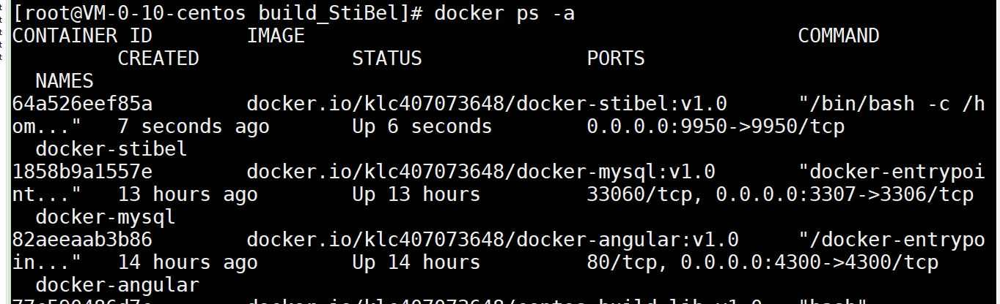
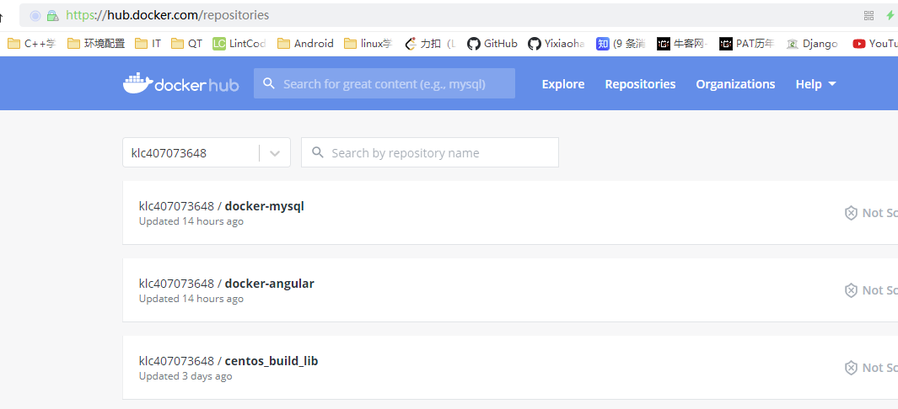

# docker_project项目

本项目主要用于记录使用docker容器构建各个微服务容器。

## 参考资料

  * [docker hub仓库](https://hub.docker.com/repositories)

## 项目内容

文件位于example下各个文件夹中，记录了数据结构、设计模式、功能函数、工具类以及StiBel库的使用样例。

* [angular](./angular/angular项目部署.md)
* [mysql](./mysql/mysql容器搭建.md)
* [StiBel](./StiBel/StiBel.md)

  
## 项目简介

只需要把以下三个容器启动，基本的微服务架构就可以了。

docker-angular提供客户端网页，docker-mysql管理后台数据，docker-stibel为服务端数据处理。



可以直接从docker仓库下载对应镜像，进行运行

```
##拉取镜像
docker pull docker.io/klc407073648/docker-stibel:v1.0
docker pull docker.io/klc407073648/docker-mysql:v1.0
docker pull docker.io/klc407073648/docker-angular:v1.0

##端口映射
docker run -it -d -p 9950:9950 --name docker-stibel docker.io/klc407073648/docker-stibel:v1.0
docker run -it -d -p 3307:3306 --name docker-mysql docker.io/klc407073648/docker-mysql:v1.0
docker run -it -d -p 4300:4300 --name docker-angular docker.io/klc407073648/docker-angular:v1.0
```



**尽量使用精简版镜像文件，不要过多的使用源码自己编译，使用现成的镜像加上简单修改**


docker run -it -d -p 8082:8082 --name apollo_client  centos:centos7