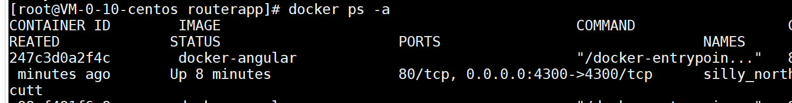
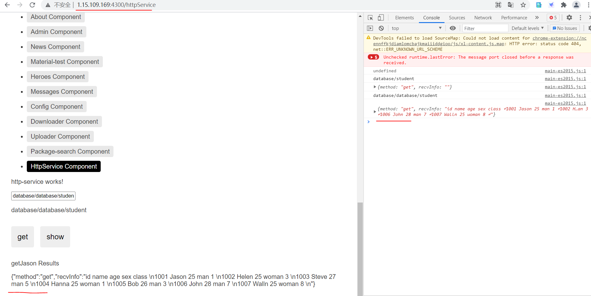

# angular项目部署到docker容器中

## 参考资料

* [docker+nginx部署angular项目](https://blog.csdn.net/weixin_43269840/article/details/104921174)
* [利用docker中的nginx镜像部署angular项目](https://www.cnblogs.com/MyUniverse/p/11288977.html)

---

## 打包项目

1. 在命令行进入项目所在位置


2. 使用ng build --prod进行打包，在该路径下就会生成一个dist文件夹

3. 将dist文件夹上传到云服务器

4. 对dist里面的文件进行赋权

```
cd /home/angular/angulartest/dist/routerapp/
chmod 777 *
```

---

## 搭建过程

源文件：

```
[root@VM-0-10-centos build_angular]# tree
.
|-- angularPrj
|   `-- dist
|       `-- routerapp
|           `-- routerapp.tar.gz
|-- Dockerfile
`-- nginx
    |-- conf
    |   `-- nginx.conf
    `-- conf.d
        `-- default.conf

```

**1.Dockerfile详细内容：**

```
FROM nginx

#将所需文件放到容器中
COPY ./nginx/conf/nginx.conf      /etc/nginx/nginx.conf
COPY ./nginx/conf.d/default.conf     /etc/nginx/conf.d/default.conf
ADD ./angularPrj/dist/routerapp/routerapp.tar.gz    /usr/share/nginx/html

#设置容器启动时执行的命令
#CMD ["sh", "/mysql/setup.sh"]
```

**2.nginx配置文件**

在nginx/conf.d中新建配置文件default.conf并将下面的内容粘贴进去

```bash
 server {
    listen       4300; # nginx监听端口
    server_name 1.15.109.169; #若有域名则将localhost替换为域名

    #charset koi8-r;
    #access_log  /var/log/nginx/host.access.log  main;

    location /api/ {
        proxy_pass http://1.15.109.169:9950/;
    }

    location /database/ {
        proxy_pass http://1.15.109.169:9950/database/;
    }
    
......
```
在nginx/conf下新建nginx.conf并将下面内容粘贴进去

```bash
worker_processes  1;
  
error_log  /var/log/nginx/error.log warn;
pid        /var/run/nginx.pid;


events {
    worker_connections  1024;
}
......
```
**3.制作镜像**

```
docker build -t docker-angular .
```

**4.执行docker run命令进行启动容器**

```bash
docker run -d -p 4300:4300 docker-angular
```



5.通过浏览器访问：http://1.15.109.169:4300


