# Docker实践 - 安装Jenkins

[[toc]]

# 参考资料

* [Docker 安装 Jenkins](https://segon.cn/install-jenkins-using-docker.html)
* [Docker + Jenkins 部署完整node项目](https://segmentfault.com/a/1190000021462867?utm_source=tag-newest)

# Docker安装Jenkins详细过程

## 安装环境 

* CentOS 7.5
* Docker version 1.13.1

```
[root@VM-0-10-centos local]# docker -v
Docker version 1.13.1, build 0be3e21/1.13.1
[root@VM-0-10-centos local]# cat /etc/*release
CentOS Linux release 7.5.1804 (Core)
```

## 安装过程

**1. 拉取镜像**

安装的版本是2.222.3-centos，可从以下地址获取其他目标版本:[https://hub.docker.com/_/jenkins?tab=tags](https://hub.docker.com/_/jenkins?tab=tags)

```bash
docker pull jenkins/jenkins:2.222.3-centos
```

**2. 创建本地数据卷**

这里映射本地数据卷的路径为/home/jenkins/data/jenkins_home/，可自行定义。

```bash
mkdir -p /data/jenkins_home/
```

需要修改下**目录权限**，因为当映射本地数据卷时，/home/jenkins/data/jenkins_home/目录的拥有者为root用户，而容器中jenkins用户的 `uid` 为 `1000`。

```bash
chown -R 1000:1000 /home/jenkins/data/jenkins_home/
```

**3. 创建容器**
```bash
docker run -d --name jenkins -p 9090:8080 -p 50000:50000 -v /home/jenkins/data/jenkins_home:/var/jenkins_home jenkins/jenkins:2.222.3-centos
```

参数说明：

```bash
-d 标识是让 docker 容器在后台运行
--name 定义一个容器的名字，如果没有指定，那么会自动生成一个随机数字符串当做UUID
-p 9090:8080 端口映射，我本地的8080被占用了，所以随便映射了一个9090
-p 50000:50000 端口映射
-v /home/jenkins/data/jenkins_home:/var/jenkins_home 绑定一个数据卷，/home/jenkins/data/jenkins_home是刚才创建的本地数据卷
```

**4. 总结**

```
cd /home/jenkins/
mkdir -p ./data/jenkins_home/
chown -R 1000:1000 /home/jenkins/data/jenkins_home/
docker run -d --name jenkins -p 9090:8080 -p 50000:50000 -v /home/jenkins/data/jenkins_home:/var/jenkins_home 
```

## 配置过程

**1. 打开 Jenkins**

通过浏览器访问 http://1.1.1.1:9090/（注意替换成你自己的IP和端口）进入初始页，如果 Jenkins 还没有启动完成，会显示如下内容：


**2. 输入管理员密码**

这里要求输入初始的管理员密码，根据提示密码在/var/jenkins_home/secrets/initialAdminPassword这个文件中，注意这个路径是 Docker 容器中的，所以我们通过如下命令获取一下。

```bash
docker exec jenkins cat /var/jenkins_home/secrets/initialAdminPassword
85770376692448b7b6a8e301fb437848
别忘了我们映射了本地数据卷/home/jenkins/data/jenkins_home，所以也可以通过如下命令输出

cat /home/jenkins/data/jenkins_home/secrets/initialAdminPassword 
85770376692448b7b6a8e301fb437848
```
输入密码后，点击继续

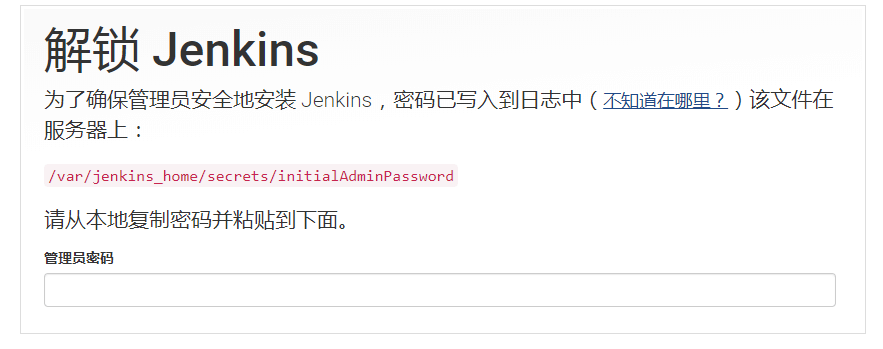

**3. 安装插件**

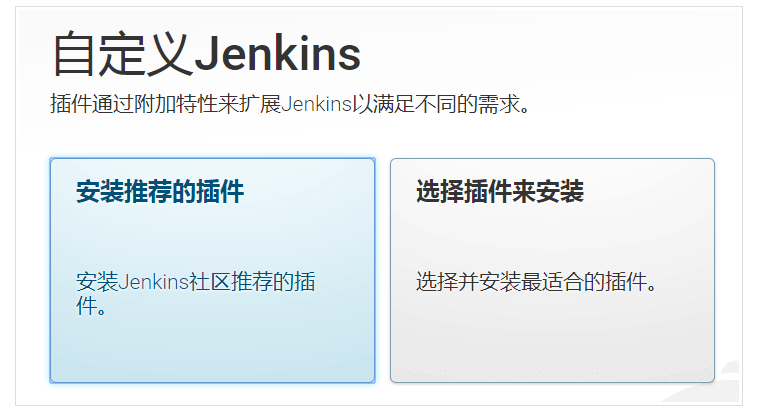

这里选择安装推荐的插件，然后 Jenkins 会自动开始安装。

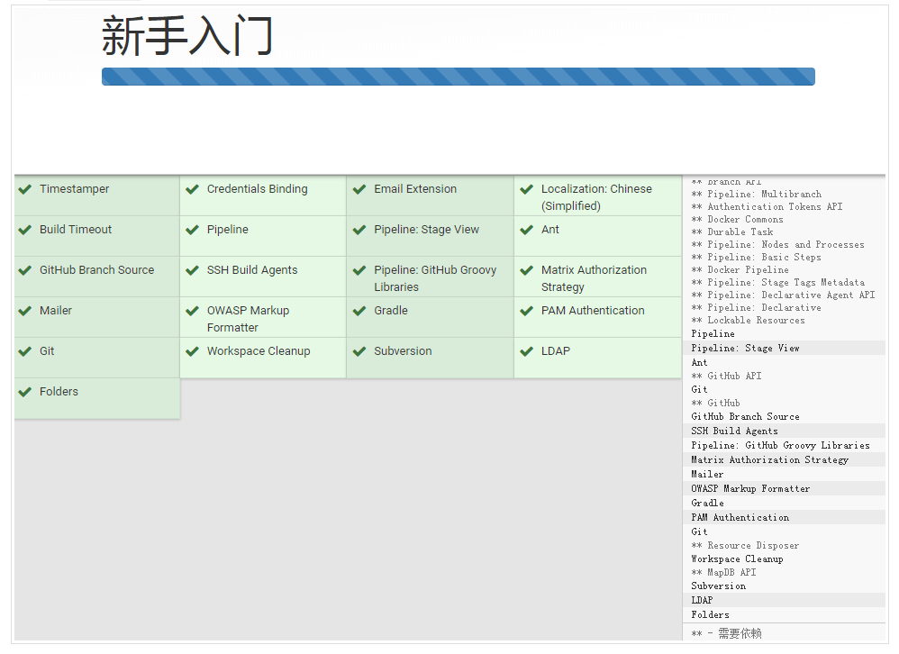

**4. 创建管理员**

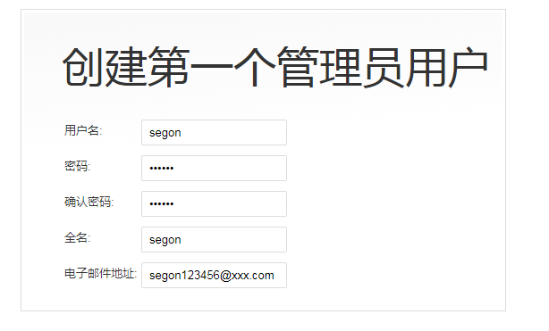

**5. 配置完成**

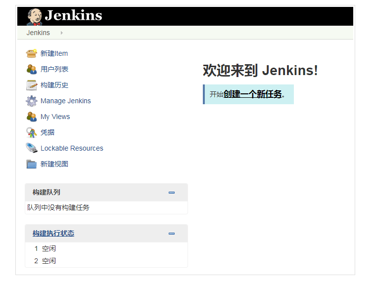


## 配置远程Linux工作节点

Jenkins ——> Manage Jenkins  ——>  Manage Nodes and Clouds

新建节点 ——> 配置节点  ——> 启动节点代理

备注：启动代理会用到宿主机上的JAVA,需要配置成1.8（jdk-8u221-linux-x64.tar.gz），详细内容见问题记录。

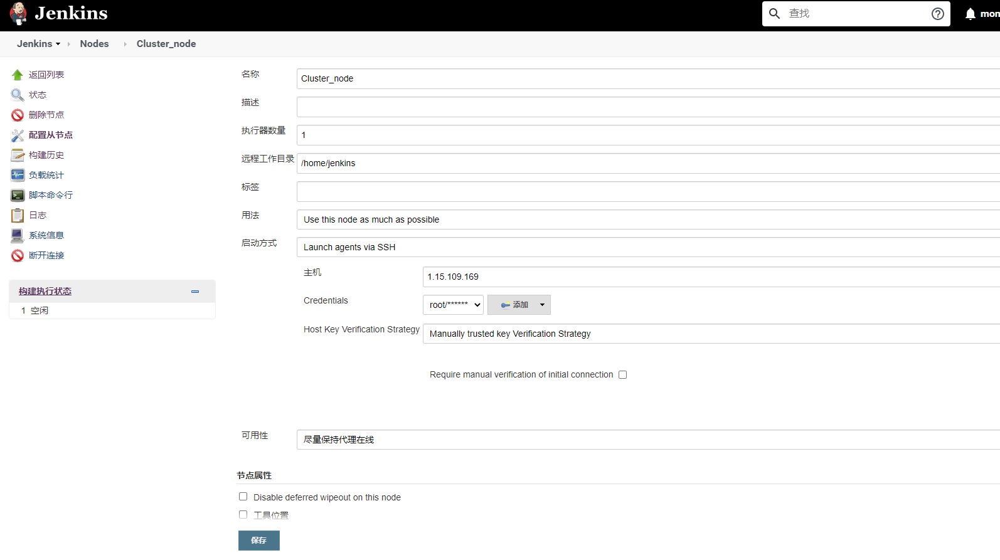

然后节点任务内容：

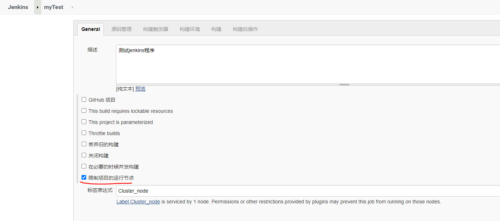

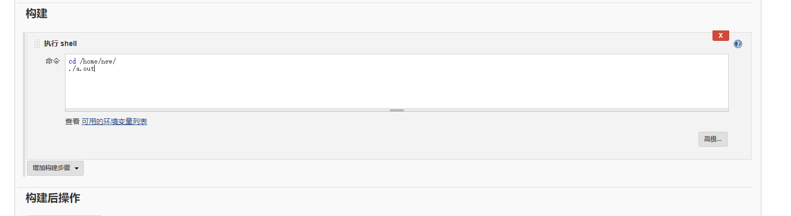

配置节点任务执行：
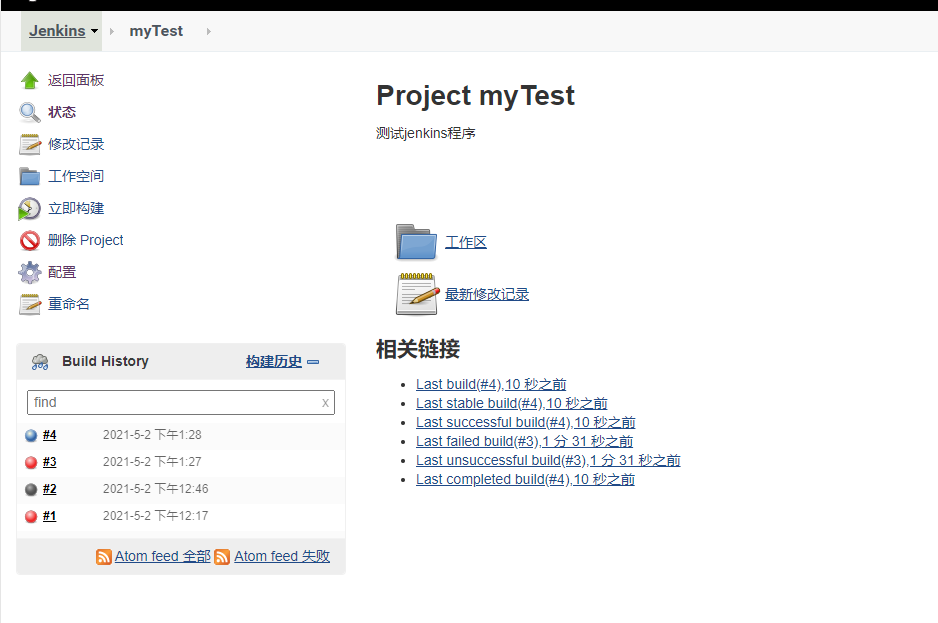

# Jenkins Pipeline配置build_lib任务

## docker安装以及镜像拉取

**从节点机器安装docker**

```
yum install -y docker
sudo systemctl start docker
sudo systemctl enable docker
```

**拉取构建所需镜像**

```
docker pull docker.io/klc407073648/centos_build_lib:v3.0
```

## jdk配置

**安装jdk**
```
cd /usr/local/
tar -zxf jdk-8u221-linux-x64.tar.gz
echo 'export JAVA_HOME=/usr/local/jdk1.8.0_221' >> /etc/profile
echo 'export JRE_HOME=$JAVA_HOME/jre' >> /etc/profile
echo 'export CLASSPATH=.:$JAVA_HOME/lib/dt.jar:$JAVA_HOME/lib/tools.jar' >> /etc/profile
echo 'export PATH=$PATH:$JAVA_HOME/bin:$JRE_HOME/bin' >> /etc/profile
source /etc/profile
```

**jenkins上配置从节点**
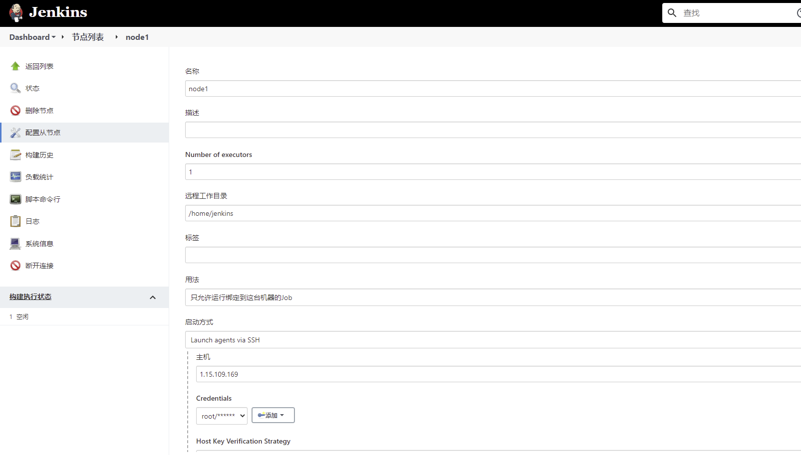

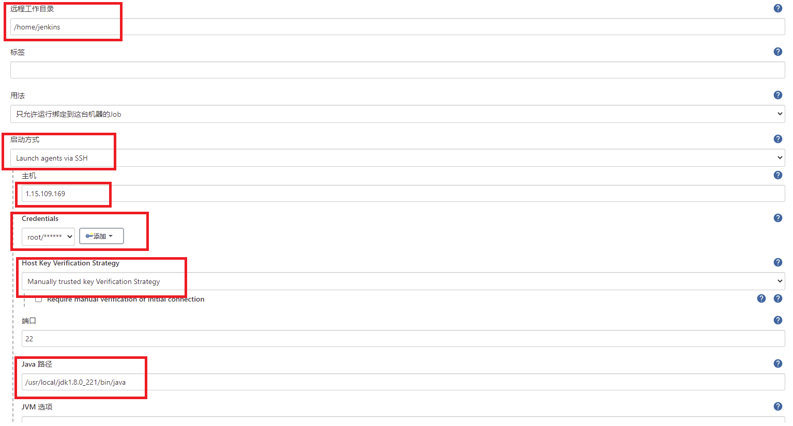


# 配置github的下载key

```bash
[root@VM-0-10-centos klc]# git config --global --list
fatal: unable to read config file '/root/.gitconfig': No such file or directory
[root@VM-0-10-centos klc]# git config --global user.name "stibel"
[root@VM-0-10-centos klc]# git config --global user.email "12345678@qq.com"
[root@VM-0-10-centos klc]# git config --global --list
user.name=stibel
user.email=12345678@qq.com

[root@VM-0-10-centos klc]# ssh-keygen -t rsa -C "12345678@qq.com"
Generating public/private rsa key pair.
Enter file in which to save the key (/root/.ssh/id_rsa):
/root/.ssh/id_rsa already exists.
Overwrite (y/n)? y
Enter passphrase (empty for no passphrase):
Enter same passphrase again:
Your identification has been saved in /root/.ssh/id_rsa.
Your public key has been saved in /root/.ssh/id_rsa.pub.
The key fingerprint is:
SHA256:mBUfLusWspmQNIBQjtVVRBKNoLySDZryhg/fJQyykWM 407073648@qq.com
The key's randomart image is:
+---[RSA 2048]----+
|oo+..o+B= .      |
|.= o. ...+ .     |
|o + o   o o      |
|.* o o + o       |
|@E+ o + S        |
|oO o . * .       |
|+ o o = o        |
| = . o .         |
|  o .            |
+----[SHA256]-----+

[root@VM-0-10-centos klc]# cat /root/.ssh/id_rsa.pub
ssh-rsa AAAAB3NzaC1yc2EAAAADAQABAAABAQC5fGxKe/i1f0mrZm4PGub88eXriwxJVpj5Il0Gb9qbjg/LekX9FLt9iUYjGLhXTKnSOccjjUyW/fg5sPMi0Kv1FlUReMwIA2QyxLJC9uLe5A1gNsW+i4aYwp2smHC0zyPm6mA1VmYDEG/6VqZBohUZKP31mkXC7/TdMTXAzrE30aUAfoN4hwVvcGm5woVSuFoCW7o1pcQhqLKjMUrO2KGzIcuxWlxzEZt+YXNSXbn7rKLnmO2DWT9ljVgAKsCrUbOGXZBNK0oK6K73jiK29U7SyN/8hYLUWOdYQJhHQsPnEcu57zOwCQjrEoMxDZI6VdItYNOcRTzocHF8XHDr94Xf 12345678@qq.com

```

将上述生成的 `id_rsa.pub` 加入github


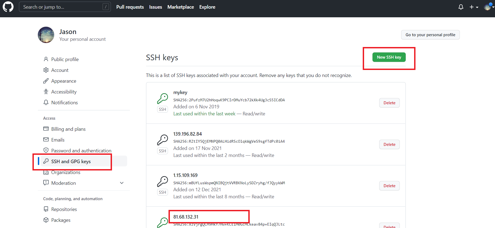

# 最终使用方法

直接执行当前路径下的脚本 `build_jenkins.sh` 即可

* 使用镜像 ———— jenkins/jenkins:lts
* Dashboard —— 系统管理 —— 节点管理 —— 新建节点
* 新建流水线任务，执行即可

```
{
    agent none

    stages {
        // 构建前清理环境
        stage('clean_before_build') {
            agent {label 'node1'}
            steps {
                dir('/home/klc/auto_job/build_lib'){
                   sh "./clean_before_build.sh" 
                }
            }
        }
        
        // 构建公共库文件
        stage('build_lib') {
            agent {label 'node1'}
            steps {
                dir('/home/klc/auto_job/build_lib'){
                   sh "./build_lib.sh"
                }
            }
        }

        // 校验构建库的demo程序
        stage('check_build_result') {
            agent {label 'node1'}
            steps {
                dir('/home/klc/auto_job/build_lib'){
                   sh "./check_build_result.sh"
                }
            }
        }

        // 清理构建后的环境
        stage('clean_after_build') {
            agent {label 'node1'}
            steps {
                dir('/home/klc/auto_job/build_lib'){
                   sh "./clean_after_build.sh"
                }
            }
        }
    }
}
```

新版本配置节点_1:

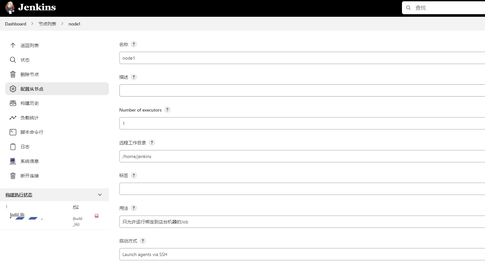

新版本配置节点_2:

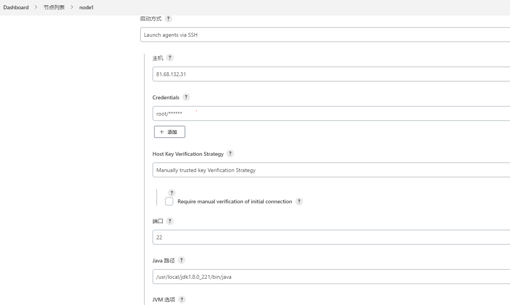

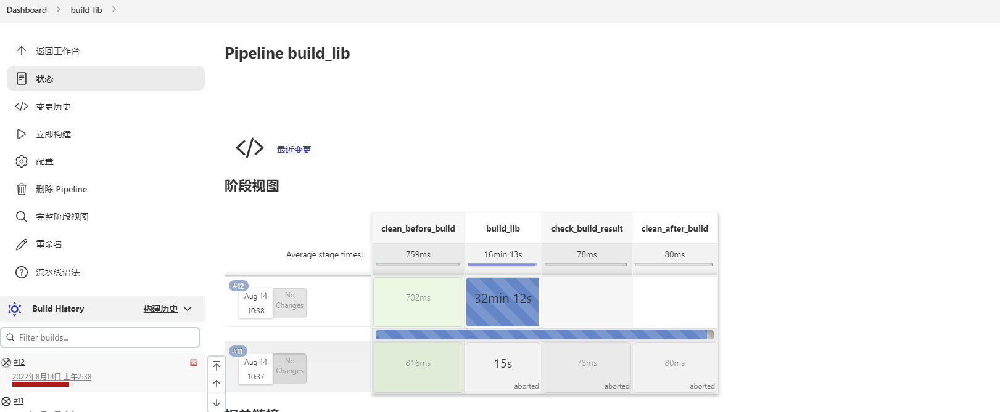
