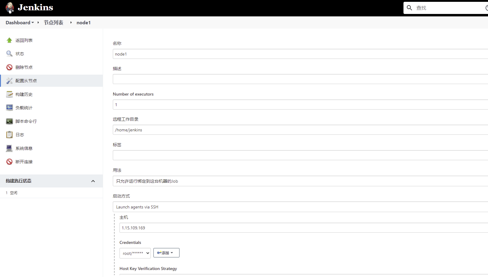
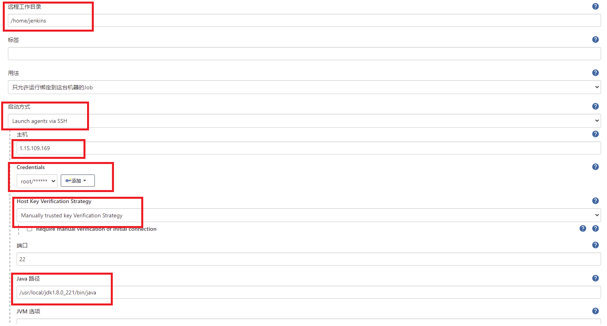

# Jenkins Pipeline配置build_lib任务


# 从节点配置

## docker安装以及镜像拉取

**从节点机器安装docker**

```
yum install -y docker
sudo systemctl start docker
sudo systemctl enable docker
```

**拉取构建所需镜像**

```
docker pull docker.io/klc407073648/centos_build_lib:v3.0
```

## jdk配置

**安装jdk**
```
cd /usr/local/
tar -zxf jdk-8u221-linux-x64.tar.gz
echo 'export JAVA_HOME=/usr/local/jdk1.8.0_221' >> /etc/profile
echo 'export JRE_HOME=$JAVA_HOME/jre'	 >> /etc/profile
echo 'export CLASSPATH=.:$JAVA_HOME/lib/dt.jar:$JAVA_HOME/lib/tools.jar' >> /etc/profile
echo 'export PATH=$PATH:$JAVA_HOME/bin:$JRE_HOME/bin'	>> /etc/profile
source /etc/profile
```

**jenkins上配置从节点**





# 配置github的下载key

```bash
[root@VM-0-10-centos klc]# git config --global --list
fatal: unable to read config file '/root/.gitconfig': No such file or directory
[root@VM-0-10-centos klc]# git config --global user.name "stibel"
[root@VM-0-10-centos klc]# git config --global user.email "407073648@qq.com"
[root@VM-0-10-centos klc]# git config --global --list
user.name=stibel
user.email=407073648@qq.com

[root@VM-0-10-centos klc]# ssh-keygen -t rsa -C "407073648@qq.com"
Generating public/private rsa key pair.
Enter file in which to save the key (/root/.ssh/id_rsa):
/root/.ssh/id_rsa already exists.
Overwrite (y/n)? y
Enter passphrase (empty for no passphrase):
Enter same passphrase again:
Your identification has been saved in /root/.ssh/id_rsa.
Your public key has been saved in /root/.ssh/id_rsa.pub.
The key fingerprint is:
SHA256:mBUfLusWspmQNIBQjtVVRBKNoLySDZryhg/fJQyykWM 407073648@qq.com
The key's randomart image is:
+---[RSA 2048]----+
|oo+..o+B= .      |
|.= o. ...+ .     |
|o + o   o o      |
|.* o o + o       |
|@E+ o + S        |
|oO o . * .       |
|+ o o = o        |
| = . o .         |
|  o .            |
+----[SHA256]-----+

[root@VM-0-10-centos klc]# cat /root/.ssh/id_rsa.pub
ssh-rsa AAAAB3NzaC1yc2EAAAADAQABAAABAQC5fGxKe/i1f0mrZm4PGub88eXriwxJVpj5Il0Gb9qbjg/LekX9FLt9iUYjGLhXTKnSOccjjUyW/fg5sPMi0Kv1FlUReMwIA2QyxLJC9uLe5A1gNsW+i4aYwp2smHC0zyPm6mA1VmYDEG/6VqZBohUZKP31mkXC7/TdMTXAzrE30aUAfoN4hwVvcGm5woVSuFoCW7o1pcQhqLKjMUrO2KGzIcuxWlxzEZt+YXNSXbn7rKLnmO2DWT9ljVgAKsCrUbOGXZBNK0oK6K73jiK29U7SyN/8hYLUWOdYQJhHQsPnEcu57zOwCQjrEoMxDZI6VdItYNOcRTzocHF8XHDr94Xf 407073648@qq.com

```

遗留：

[对YAML :: LoadFile的未定义引用](https://cloud.tencent.com/developer/ask/219444)