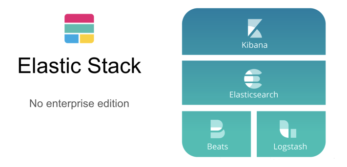
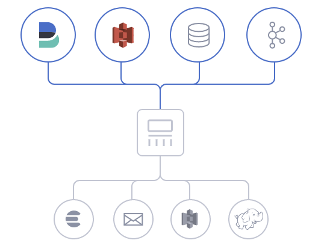
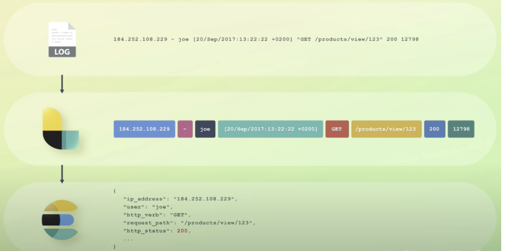

# Elastic 总览 
Elastic 是一个搜索公司。搜索不仅仅代表一个搜索框。 

 

在网络上搜索内容或在应用程序上搜索内容。

 

* 可视化搜索。搜索通过图形或图表可视化日志和/或指标数据。
* 过滤器搜索。使用自己喜欢的应用程序通过寻找距离你最近并且可以接受信用卡并且具有4星级评级的餐馆来寻找餐馆。 
* 地图搜索。搜索行车路线。

## Elasticsearch

Elasticsearch 是一个分布式的开源搜索和分析引擎，适用于所有类型的数据，包括文本，数字，地理空间，结构化和非结构化。Elasticsearch 基于 Apache Lucene 构建，并于2010年由 Elasticsearch N.V.（现称为 Elastic）首次发布。

Elasticsearch 以其简单的 REST API，分布式性质，速度和易扩展性而闻名。Elasticsearch 的搜索体验的基本原则是规模（scale），速度（speed），相关性（relevance）。

* Scale：可扩展性是指摄取和处理PB级数据的能力。Elasticsearch 集群是分布式的，所以它很容根据商业的需求来扩容。如果需要存储更多的数据，我们很容添加更多的服务器来进行满足商业的需求。

* Speed：快速获得搜索结果的能力， 即使在大规模的情况下。 在中国有一种说法：天下武功唯快不破。Elasticsearch 可以在 PB 级数据情况下，也能获得毫秒级的全文搜索。即使是新数据导入到 Elasticsearch 中，也可以在 1 秒内变为可以搜索，从而实现近实时的搜索。对于有的数据库来说，搜索可能是需要数小时才能完成。
* Relevance： 关联性是一种能够以任意方式查询数据并获得相关结果的能力，而不论是查看文本，数字还是地理数据。Elasticsearch 可以根据数据的匹配度来返回数据。每个搜索的结果有一个分数，它表示匹配的相关度。在返回的数据结果中，匹配度最大的结果排在返回的结果的前面。

## Elastic Stack

 

“ELK” 是三个开源项目的缩写：Elasticsearch，Logstash 和 Kibana。 Elasticsearch 是搜索和分析引擎。

* Elasticsearch 是整个 Elastic Stack 的核心组件。 
* Logstash 是一个服务器端数据处理管道，它同时从多个源中提取数据，进行转换，然后将其发送到类似 Elasticsearch 的 “存储” 中。Beats 是一些轻量级的数据摄入器的组合，用于将数据发送到 Elasticsearch 或发向 Logstash 做进一步的处理，并最后导入到 Elasticsearch。 
* Kibana 允许用户在 Elasticsearch 中使用图表将数据可视化。Kibana 也在不断地完善。它可以对 Elastic Stack 进行监控，管理。同时它也集成了许多应用。这些应用包括 Logs, Metrics，机器学习，Maps 等等。

## Elastic 方案

Elastic 公司围绕 Elastic Stack 创建了许多的开箱即用的方案。对于很多搜索或数据库的公司来说，他们可能有很好的产品，但是运用它们开发一套实现某种方案来说，也是需要很多的精力来组合不同公司的产品来完成这些方案。

# Logstash 简介

Logstash 是一个功能强大的工具，可与各种部署集成。 它提供了大量插件，可帮助你解析，丰富，转换和缓冲来自各种来源的数据。 如果你的数据需要 Beats 中没有的其他处理，则需要将 Logstash 添加到部署中。

## 输入、过滤器和输出

Logstash 能够动态地采集、转换和传输数据，不受格式或复杂度的影响。利用 Grok 从非结构化数据中派生出结构，从 IP 地址解码出地理坐标，匿名化或排除敏感字段，并简化整体处理过程。

### 输入

**采集各种样式、大小和来源的数据**

* 数据往往以各种各样的形式，或分散或集中地存在于很多系统中。Logstash 支持[各种输入选择](https://www.elastic.co/guide/en/logstash/current/input-plugins.html)，可以同时从众多常用来源捕捉事件。能够以连续的流式传输方式，轻松地从您的日志、指标、Web 应用、数据存储以及各种 AWS 服务采集数据。

 

### 过滤器

**实时解析和转换数据**

数据从源传输到存储库的过程中，Logstash 过滤器能够解析各个事件，识别已命名的字段以构建结构，并将它们转换成通用格式，以便进行更强大的分析和实现商业价值。

Logstash 能够动态地转换和解析数据，不受格式或复杂度的影响：

- 利用 Grok 从非结构化数据中派生出结构
- 从 IP 地址破译出地理坐标
- 将 PII 数据匿名化，完全排除敏感字段
- 简化整体处理，不受数据源、格式或架构的影响

使用我们丰富的[过滤器库](https://www.elastic.co/guide/en/logstash/current/filter-plugins.html)和功能多样的 [Elastic Common Schema](https://www.elastic.co/cn/blog/introducing-the-elastic-common-schema)，您可以实现无限丰富的可能。

 

### 输出

**选择您的存储库，导出您的数据**

* 尽管 Elasticsearch 是我们的首选输出方向，能够为我们的搜索和分析带来无限可能，但它并非唯一选择。
* Logstash 提供[众多输出选择](https://www.elastic.co/guide/en/logstash/current/output-plugins.html)，您可以将数据发送到您要指定的地方，并且能够灵活地解锁众多下游用例。

 

## 小结

尽管 Logstash 不仅仅处理 Log，但是如果我们以 Log 为例来描述它在 Elastic Stack 中的工作流程，它可以用如下的一张图来进行描述：

 

处理过程：

* 最原始的 Log 数据，经过 Logstash 的处理，可以把非结构化的数据变成结构化的数据。
* 甚至可以使用 Logstash 强大的 Filter 来对数据继续加工。可以使用 GeoIP 过滤器来丰富 IP 地址字段，从而能得到具体的的位置信息。
* 最终转换成我们需要的格式数据
