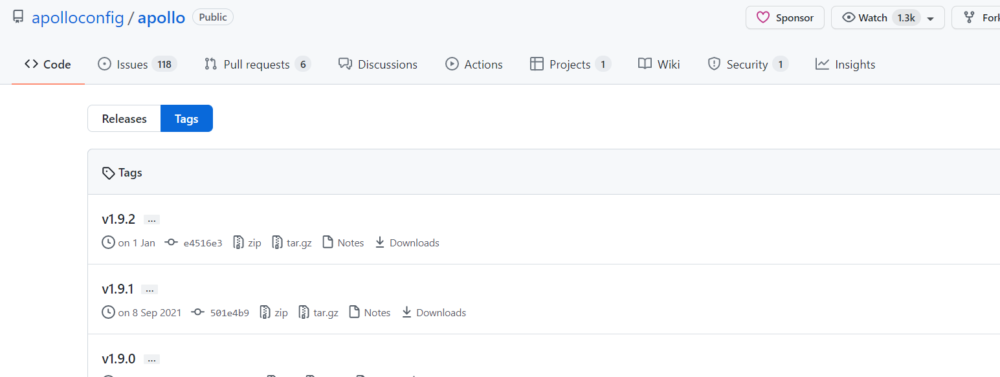
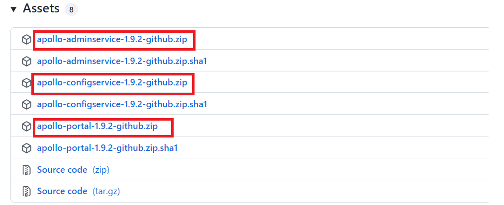

# Apollo安装与使用

## 安装Apollo运行时环境

Java

- Apollo服务端：1.8+
- Apollo客户端：1.7+

由于需要同时运行服务端和客户端，所以建议安装Java 1.8+。

MySQL

- 版本要求：5.6.5+

Apollo的表结构对`timestamp`使用了多个default声明，所以需要5.6.5以上版本。

## 下载配置

1. 访问Apollo的官方主页获取安装包：

   https://github.com/ctripcorp/apollo/tags

   

1. 打开v1.9.2发布链接，下载必须的安装包：https://github.com/apolloconfig/apollo/releases/tag/v1.9.2

    

2. 解压安装包后将apollo-configservice-1.3.0.jar, apollo-adminservice-1.3.0.jar, apollo-portal-1.3.0.jar放置于apollo目录下

## 创建数据库

Apollo服务端共需要两个数据库：`ApolloPortalDB`和`ApolloConfigDB`，ApolloPortalDB只需要在生产环境部署一个即可，而ApolloConfigDB需要在每个环境部署一套。

1. 创建ApolloPortalDB，sql脚本下载地址：[apolloportaldb.sql](https://github.com/apolloconfig/apollo/blob/v1.9.2/scripts/sql/apolloportaldb.sql)

   以MySQL原生客户端为例：

   ```
    source apollo/apolloportaldb.sql
   ```

2. 验证ApolloPortalDB

   导入成功后，可以通过执行以下sql语句来验证：

   ```
    select `Id`, `Key`, `Value`, `Comment` from `ApolloPortalDB`.`ServerConfig` limit 1;
   ```

   > 注：ApolloPortalDB只需要在生产环境部署一个即可

3. 创建ApolloConfigDB，sql脚本下载地址：[apolloconfigdb.sql](https://github.com/apolloconfig/apollo/blob/v1.9.2/scripts/sql/apolloconfigdb.sql)

   ```
    source apollo/apolloconfigdb.sql
   ```
   
4. 验证ApolloConfigDB

   导入成功后，可以通过执行以下sql语句来验证：

   ```
    select `Id`, `Key`, `Value`, `Comment` from `ApolloConfigDB`.`ServerConfig` limit 1;
   ```

## 启动Apollo

1. 确保端口未被占用

   Apollo默认会启动3个服务，分别使用8070, 8080, 8090端口，请确保这3个端口当前没有被使用

2. 启动apollo-configservice，在apollo目录下执行如下命令

   可通过-Dserver.port=8080修改默认端口

   ```
   java -Xms256m -Xmx256m -Dspring.datasource.url=jdbc:mysql://localhost:3306/ApolloConfigDB?characterEncoding=utf8 -Dspring.datasource.username=root -Dspring.datasource.password=pbteach0430 -jar apollo-configservice-1.3.0.jar
   ```

   

3. 启动apollo-adminservice

   可通过-Dserver.port=8090修改默认端口

   ```
    java -Xms256m -Xmx256m -Dspring.datasource.url=jdbc:mysql://localhost:3306/ApolloConfigDB?characterEncoding=utf8 -Dspring.datasource.username=root -Dspring.datasource.password=pbteach0430 -jar apollo-adminservice-1.3.0.jar
   ```

   

4. 启动apollo-portal

   可通过-Dserver.port=8070修改默认端口

   ```
   java -Xms256m -Xmx256m -Ddev_meta=http://localhost:8080/ -Dserver.port=8070 -Dspring.datasource.url=jdbc:mysql://localhost:3306/ApolloPortalDB?characterEncoding=utf8 -Dspring.datasource.username=root -Dspring.datasource.password=pbteach0430 -jar apollo-portal-1.3.0.jar
   ```

   

5. 也可以使用提供的runApollo.bat快速启动三个服务（修改数据库连接地址，数据库以及密码）

   ```
    echo
    
    set url="localhost:3306"
    set username="root"
    set password="123"
    
    start "configService" java -Xms256m -Xmx256m -Dapollo_profile=github -Dspring.datasource.url=jdbc:mysql://%url%/ApolloConfigDB?characterEncoding=utf8 -Dspring.datasource.username=%username% -Dspring.datasource.password=%password% -Dlogging.file=.\logs\apollo-configservice.log -jar .\apollo-configservice-1.3.0.jar
    start "adminService" java -Xms256m -Xmx256m -Dapollo_profile=github -Dspring.datasource.url=jdbc:mysql://%url%/ApolloConfigDB?characterEncoding=utf8 -Dspring.datasource.username=%username% -Dspring.datasource.password=%password% -Dlogging.file=.\logs\apollo-adminservice.log -jar .\apollo-adminservice-1.3.0.jar
    start "ApolloPortal" java -Xms256m -Xmx256m -Dapollo_profile=github,auth -Ddev_meta=http://localhost:8080/ -Dserver.port=8070 -Dspring.datasource.url=jdbc:mysql://%url%/ApolloPortalDB?characterEncoding=utf8 -Dspring.datasource.username=%username% -Dspring.datasource.password=%password% -Dlogging.file=.\logs\apollo-portal.log -jar .\apollo-portal-1.3.0.jar
   ```

6. 运行runApollo.bat即可启动Apollo

7. 待启动成功后，访问[管理页面](http://localhost:8070/) apollo/admin

   

 

## 代码实现

### 发布配置

1. 打开[apollo](http://localhost:8070/) ：新建项目apollo-quickstart

   

2. 新建配置项sms.enable

   

   确认提交配置项

    

3. 发布配置项


#### 3.3.2 应用读取配置

1、新建Maven工程

打开idea，新建apollo-quickstart项目


打开pom.xml文件添加apollo依赖，配置JDK为1.8

```
 <?xml version="1.0" encoding="UTF-8"?>
 <project xmlns="http://maven.apache.org/POM/4.0.0"
          xmlns:xsi="http://www.w3.org/2001/XMLSchema-instance"
          xsi:schemaLocation="http://maven.apache.org/POM/4.0.0 http://maven.apache.org/xsd/maven-4.0.0.xsd">
     <modelVersion>4.0.0</modelVersion>
 
     <groupId>com.pbteach</groupId>
     <artifactId>apollo-quickstart</artifactId>
     <version>1.0-SNAPSHOT</version>
 
     <properties>
         <java.version>1.8</java.version>
     </properties>
 
     <dependencies>
         <dependency>
             <groupId>com.ctrip.framework.apollo</groupId>
             <artifactId>apollo-client</artifactId>
             <version>1.1.0</version>
         </dependency>
 
         <dependency>
             <groupId>org.slf4j</groupId>
             <artifactId>slf4j-simple</artifactId>
             <version>1.7.28</version>
         </dependency>
     </dependencies>
     <build>
         <plugins>
             <plugin>
                 <groupId>org.apache.maven.plugins</groupId>
                 <artifactId>maven-compiler-plugin</artifactId>
                 <configuration>
                     <source>8</source>
                     <target>8</target>
                 </configuration>
             </plugin>
         </plugins>
     </build>
 </project>
```

 

2、编写测试类GetConfigTest

新建com.pbteach.apollo.quickstart包，添加测试类GetConfigTest

添加如下代码读取sms.enable的值

```
 package com.pbteach.apollo.quickstart;
 
 public class GetConfigTest {
 
 // VM options:
 // -Dapp.id=apollo-quickstart -Denv=DEV -Ddev_meta=http://localhost:8080
 public static void main(String[] args) {
 Config config = ConfigService.getAppConfig();
 String someKey = "sms.enable";
 String value = config.getProperty(someKey, null);
 System.out.println("sms.enable: " + value);
 }
 }
```

3、测试

配置VM options，设置系统属性：

```
 -Dapp.id=apollo-quickstart -Denv=DEV -Ddev_meta=http://localhost:8080
```


运行GetConfigTest，打开控制台，观察输出结果


#### 3.3.4 修改配置

1. 修改sms.enable的值为false

   

2. 再次运行GetConfigTest，可以看到输出结果已为false

   


#### 3.3.5 热发布

1. 修改代码为每3秒获取一次

   ```
    public class GetConfigTest {
    
    public static void main(String[] args) throws InterruptedException {
    Config config = ConfigService.getAppConfig();
    String someKey = "sms.enable";
    
    while (true) {
    String value = config.getProperty(someKey, null);
    System.out.printf("now: %s, sms.enable: %s%n", LocalDateTime.now().toString(), value);
    Thread.sleep(3000L);
    }
    }
    }
   ```

2. 运行GetConfigTest观察输出结果

   

3. 在Apollo管理界面修改配置项

   

4. 发布配置

   

5. 在控制台查看详细情况：可以看到程序获取的sms.enable的值已由false变成了修改后的true

   

 

# Apollo应用于分布式系统

在微服务架构模式下，项目往往会切分成多个微服务，下面将以万信金融P2P项目为例演示如何在项目中使用。

## 项目场景介绍


#### 5.1.1 项目概述

 万信金融是一款面向互联网大众提供的理财服务和个人消费信贷服务的金融平台，依托大数据风控技术，为用户提供方便、快捷、安心的P2P金融服务。本项目包括交易平台和业务支撑两个部分，交易平台主要实现理财服务，包括：借钱、出借等模块，业务支撑包括：标的管理、对账管理、风控管理等模块。项目采用先进的互联网技术进行研发，保证了P2P双方交易的安全性、快捷性及稳定性。


#### 5.1.2 各微服务介绍

本章节仅仅是为了演示配置中心，所以摘取了部分微服务，如下：

用户中心服务(consumer-service)：为借款人和投资人提供用户账户管理服务，包括：注册、开户、充值、提现等

UAA认证服务(uaa-service)：为用户中心的用户提供认证服务

统一账户服务(account-service)：对借款人和投资人的登录平台账号进行管理，包括：注册账号、账号权限管理等

交易中心(transaction-service)：负责P2P平台用户发标和投标功能


### 5.2 Spring Boot应用集成

下面以集成统一账户服务(account-service)为例


#### 5.2.1 导入工程

参考account-service、transaction-service、uaa-service、consumer-service工程，手动创建这几个微服务。

每个工程必须添加依赖：

```
 <dependency>
  <groupId>com.ctrip.framework.apollo</groupId>
  <artifactId>apollo-client</artifactId>
  <version>1.1.0</version>
 </dependency>
```

下边是account-service依赖，其它工程参考“资料”下的“微服务”。

```
 <?xml version="1.0" encoding="UTF-8"?>
 <project xmlns="http://maven.apache.org/POM/4.0.0" xmlns:xsi="http://www.w3.org/2001/XMLSchema-instance"
          xsi:schemaLocation="http://maven.apache.org/POM/4.0.0 http://maven.apache.org/xsd/maven-4.0.0.xsd">
    <modelVersion>4.0.0</modelVersion>
    <parent>
        <groupId>org.springframework.boot</groupId>
        <artifactId>spring-boot-starter-parent</artifactId>
        <version>2.1.3.RELEASE</version>
        <relativePath/> <!-- lookup parent from repository -->
    </parent>
    <groupId>com.pbteach</groupId>
    <artifactId>account-service</artifactId>
    <version>0.0.1-SNAPSHOT</version>
 
    <properties>
        <java.version>1.8</java.version>
    </properties>
 
    <dependencies>
        <dependency>
            <groupId>org.springframework.boot</groupId>
            <artifactId>spring-boot-starter</artifactId>
            <exclusions>
                <exclusion>
                    <groupId>org.springframework.boot</groupId>
                    <artifactId>spring-boot-starter-logging</artifactId>
                </exclusion>
            </exclusions>
        </dependency>
 
        <dependency>
            <groupId>org.springframework.boot</groupId>
            <artifactId>spring-boot-starter-log4j2</artifactId>
        </dependency>
 
        <dependency>
            <groupId>org.springframework.boot</groupId>
            <artifactId>spring-boot-starter-web</artifactId>
        </dependency>
 
        <dependency>
            <groupId>org.springframework.boot</groupId>
            <artifactId>spring-boot-configuration-processor</artifactId>
            <optional>true</optional>
        </dependency>
 
        <dependency>
            <groupId>com.ctrip.framework.apollo</groupId>
            <artifactId>apollo-client</artifactId>
            <version>1.1.0</version>
        </dependency>
 
    </dependencies>
 
 </project>
 
```

 


#### 5.2.2 必选配置

1. AppId：在Spring Boot application.properties或application.yml中配置

   application.properties

   ```
    app.id=account-service
   ```

   application.yml

   ```
    app:
    id: account-service
   ```

2. apollo.bootstrap

   集成springboot，开启apollo.bootstrap，指定namespace

   例子：

   ```
    apollo.bootstrap.enabled = true
    apollo.bootstrap.namespaces = application,micro_service.spring-boot-http,spring-rocketmq,micro_service.spring-boot-druid
    
   ```

3. Apollo Meta Server

   Apollo支持应用在不同的环境有不同的配置，常用的指定方式有如下两种：

   - 第一种：通过Java System Property的apollo.meta：`-Dapollo.meta=http://localhost:8080`

   - 第二种：在resources目录下新建apollo-env.properties文件

     ```
      dev.meta=http://localhost:8080
      pro.meta=http://localhost:8081
     ```

4. 本地缓存路径

   Apollo客户端会把从服务端获取到的配置在本地文件系统缓存一份，用于在遇到服务不可用，或网络不通的时候，依然能从本地恢复配置，不影响应用正常运行。本地配置文件会以下面的文件名格式放置于配置的本地缓存路径下：{appId}+{cluster}+{namespace}.properties

   

   可以通过如下方式指定缓存路径，通过Java System Property的apollo.cacheDir：

   ```
    -Dapollo.cacheDir=/opt/data/apollo-config
   ```

5. Environment

   通过Java System Property的env来指定环境：`-Denv=DEV`

6. Cluster（集群）

   通过Java System Property的apollo.cluste来指定集群：`-Dapollo.cluster=DEFAULT`

   也可以选择使用之前新建的SHAJQ集群：`-Dapollo.cluster=SHAJQ`

7. 完整的VM Options如下：

   ```
    -Denv=DEV -Dapollo.cacheDir=/opt/data/apollo-config -Dapollo.cluster=DEFAULT
   ```

   

 


#### 5.2.3 启用配置

在咱们应用的启动类添加`@EnableApolloConfig`注解即可：

```
 @SpringBootApplication(scanBasePackages = "com.pbteach.account")
 @EnableApolloConfig
 public class AccountApplication {
 
 public static void main(String[] args) {
 SpringApplication.run(AccountApplication.class, args);
 }
 }
```


#### 5.2.4 应用配置

1. 将local-config/account.properties中的配置添加到apollo中

   ```
   swagger.enable=true
   sms.enable=true
   
   spring.http.encoding.charset=UTF-8
   spring.http.encoding.force=true
   spring.http.encoding.enabled=true
   server.use-forward-headers=true
   server.tomcat.protocol_header=x-forwarded-proto
   server.servlet.context-path=/account-service
   server.tomcat.remote_ip_header=x-forwarded-for
   
   spring.datasource.driver-class-name=com.mysql.cj.jdbc.Driver
   spring.datasource.druid.stat-view-servlet.allow=127.0.0.1,192.168.163.1
   spring.datasource.druid.web-stat-filter.session-stat-enable=false
   spring.datasource.druid.max-pool-prepared-statement-per-connection-size=20
   spring.datasource.druid.max-active=20
   spring.datasource.druid.stat-view-servlet.reset-enable=false
   spring.datasource.druid.validation-query=SELECT 1 FROM DUAL
   spring.datasource.druid.stat-view-servlet.enabled=true
   spring.datasource.druid.web-stat-filter.enabled=true
   spring.datasource.druid.stat-view-servlet.url-pattern=/druid/*
   spring.datasource.druid.stat-view-servlet.deny=192.168.1.73
   spring.datasource.url=jdbc\:mysql\://127.0.0.1\:3306/p2p_account?useUnicode\=true
   spring.datasource.druid.filters=config,stat,wall,log4j2
   spring.datasource.druid.test-on-return=false
   spring.datasource.druid.web-stat-filter.profile-enable=true
   spring.datasource.druid.initial-size=5
   spring.datasource.druid.min-idle=5
   spring.datasource.druid.max-wait=60000
   spring.datasource.druid.web-stat-filter.session-stat-max-count=1000
   spring.datasource.druid.pool-prepared-statements=true
   spring.datasource.druid.test-while-idle=true
   spring.datasource.password=pbteach0430
   spring.datasource.username=root
   spring.datasource.druid.stat-view-servlet.login-password=admin
   spring.datasource.druid.stat-view-servlet.login-username=admin
   spring.datasource.druid.web-stat-filter.url-pattern=/*
   spring.datasource.druid.time-between-eviction-runs-millis=60000
   spring.datasource.druid.min-evictable-idle-time-millis=300000
   spring.datasource.druid.test-on-borrow=false
   spring.datasource.druid.web-stat-filter.principal-session-name=admin
   spring.datasource.druid.filter.stat.log-slow-sql=true
   spring.datasource.druid.web-stat-filter.principal-cookie-name=admin
   spring.datasource.type=com.alibaba.druid.pool.DruidDataSource
   spring.datasource.druid.aop-patterns=com.pbteach.wanxinp2p.*.service.*
   spring.datasource.druid.filter.stat.slow-sql-millis=1
   spring.datasource.druid.web-stat-filter.exclusions=*.js,*.gif,*.jpg,*.png,*.css,*.ico,/druid/*
   ```

    

2. spring-http命名空间在之前已通过关联公共命名空间添加好了，现在来添加spring-boot-druid命名空间

   

3. 添加本地文件中的配置到对应的命名空间，然后发布配置

   

4. 在account-service/src/main/resources/application.properties中配置apollo.bootstrap.namespaces需要引入的命名空间

   ```
    app.id=account-service
    apollo.bootstrap.enabled = true
    apollo.bootstrap.namespaces = application,micro_service.spring-boot-http,spring-rocketmq,spring-boot-druid
    
    server.port=63000
   ```


#### 5.2.5 读取配置

1. 启动应用

   

2. 访问：http://127.0.0.1:63000/account-service/hi，确认Spring Boot中配置的context-path是否生效

   

   通过/account-service能正常访问，说明apollo的配置已生效

   

3. 确认spring-boot-druid配置

   - 为了快速确认可以在AccountController中通过@Value获取来验证

     ```
     	@GetMapping("/db-url")
     	public String getDBConfig(@Value("${spring.datasource.url}") String url) {
     return url;
     	}
     ```

   - 访问http://127.0.0.1:63000/account-service/db-url，显示结果

     


#### 5.3.6 创建其它项目

参考account-service将其它项目也创建完成。

 


### 5.4 生产环境部署

当一个项目要上线部署到生产环境时，项目的配置比如数据库连接、RocketMQ地址等都会发生变化，这时候就需要通过Apollo为生产环境添加自己的配置。


#### 5.4.1 企业部署方案

在企业中常用的部署方案为：Apollo-adminservice和Apollo-configservice两个服务分别在线上环境(pro)，仿真环境(uat)和开发环境(dev)各部署一套，Apollo-portal做为管理端只部署一套，统一管理上述三套环境。

具体如下图所示：


下面以添加生产环境部署为例


#### 5.4.2 创建数据库

创建生产环境的ApolloConfigDB：每添加一套环境就需要部署一套ApolloConfgService和ApolloAdminService

source apollo/ApolloConfigDB_PRO__initialization.sql


#### 5.4.3 配置启动参数

1. 设置生产环境数据库连接
2. 设置ApolloConfigService端口为：8081，ApolloAdminService端口为8091

```
echo

set url="localhost:3306"
set username="root"
set password="mysqlpwd"

start "configService-PRO" java -Dserver.port=8081 -Xms256m -Xmx256m -Dapollo_profile=github -Dspring.datasource.url=jdbc:mysql://%url%/ApolloConfigDBPRO?characterEncoding=utf8 -Dspring.datasource.username=%username% -Dspring.datasource.password=%password% -Dlogging.file=.\logs\apollo-configservice.log -jar .\apollo-configservice-1.3.0.jar
start "adminService-PRO" java -Dserver.port=8091 -Xms256m -Xmx256m -Dapollo_profile=github -Dspring.datasource.url=jdbc:mysql://%url%/ApolloConfigDBPRO?characterEncoding=utf8 -Dspring.datasource.username=%username% -Dspring.datasource.password=%password% -Dlogging.file=.\logs\apollo-adminservice.log -jar .\apollo-adminservice-1.3.0.jar
```

1. 运行runApollo-PRO.bat


#### 5.4.4 修改Eureka地址

更新生产环境Apollo的Eureka地址：

```
USE ApolloConfigDBPRO;

UPDATE ServerConfig SET `Value` = "http://localhost:8081/eureka/" WHERE `key` = "eureka.service.url";
```


#### 5.4.5 调整ApolloPortal服务配置

服务配置项统一存储在ApolloPortalDB.ServerConfig表中，可以通过`管理员工具 - 系统参数`页面进行配置：apollo.portal.envs - 可支持的环境列表


默认值是dev，如果portal需要管理多个环境的话，以逗号分隔即可（大小写不敏感），如：

```
 dev,pro
```


#### 5.4.6 启动ApolloPortal

Apollo Portal需要在不同的环境访问不同的meta service(apollo-configservice)地址，所以我们需要在配置中提供这些信息。

```
 -Ddev_meta=http://localhost:8080/ -Dpro_meta=http://localhost:8081/
```

1. 关闭之前启动的ApolloPortal服务，使用runApolloPortal.bat启动多环境配置

   ```
    echo
    
    set url="localhost:3306"
    set username="root"
    set password="123"
    
    start "ApolloPortal" java -Xms256m -Xmx256m -Dapollo_profile=github,auth -Ddev_meta=http://localhost:8080/ -Dpro_meta=http://localhost:8081/ -Dserver.port=8070 -Dspring.datasource.url=jdbc:mysql://%url%/ApolloPortalDB?characterEncoding=utf8 -Dspring.datasource.username=%username% -Dspring.datasource.password=%password% -Dlogging.file=.\logs\apollo-portal.log -jar .\apollo-portal-1.3.0.jar
   ```

2. 启动之后，点击account-service服务配置后会提示环境缺失，此时需要补全上边新增生产环境的配置

   

3. 点击补缺环境

   

4. 补缺过生产环境后，切换到PRO环境后会提示有Namespace缺失，点击补缺

   

   

5. 从dev环境同步配置到pro

   

   


#### 5.4.7 验证配置

1. 同步完成后，切换到pro环境，修改生产环境rocketmq地址后发布配置

   

2. 配置项目使用pro环境，测试配置是否生效

   - 在apollo-env.properties中增加pro.meta=[http://localhost:8081](http://localhost:8081/)

   - 修改account-service启动参数为：-Denv=pro

     ```
      -Denv=pro -Dapollo.cacheDir=/opt/data/apollo-config -Dapollo.cluster=DEFAULT
     ```

   - 访问http://127.0.0.1:63000/account-service/mq 验证RocketMQ地址是否为上边设置的PRO环境的值

     


### 5.5 灰度发布


#### 5.5.1 定义

 灰度发布是指在黑与白之间，能够平滑过渡的一种发布方式。在其上可以进行A/B testing，即让一部分用户继续用产品特性A，一部分用户开始用产品特性B，如果用户对B没有什么反对意见，那么逐步扩大范围，把所有用户都迁移到B上面来。


#### 5.5.2 Apollo实现的功能

1. 对于一些对程序有比较大影响的配置，可以先在一个或者多个实例生效，观察一段时间没问题后再全量发布配置。
2. 对于一些需要调优的配置参数，可以通过灰度发布功能来实现A/B测试。可以在不同的机器上应用不同的配置，不断调整、测评一段时间后找出较优的配置再全量发布配置。


#### 5.5.3 场景介绍

apollo-quickstart项目有两个客户端：

1. 172.16.0.160
2. 172.16.0.170


灰度目标

当前有一个配置timeout=2000，我们希望对172.16.0.160灰度发布timeout=3000，对172.16.0.170仍然是timeout=2000。


#### 5.5.4 创建灰度

1. 点击application namespace右上角的`创建灰度`按钮

   

2. 点击确定后，灰度版本就创建成功了，页面会自动切换到`灰度版本`Tab

   


#### 5.5.5 灰度配置

1. 点击`主版本的配置`中，timeout配置最右侧的`对此配置灰度`按钮

   

2. 在弹出框中填入要灰度的值：3000，点击提交

   

   


#### 5.5.6 配置灰度规则

1. 切换到`灰度规则`Tab，点击`新增规则`按钮

   

2. 在弹出框中`灰度的IP`下拉框会默认展示当前使用配置的机器列表，选择我们要灰度的IP，点击完成

   

   

   如果下拉框中没找到需要的IP，说明机器还没从Apollo取过配置，可以点击手动输入IP来输入，输入完后点击添加按钮

   


#### 5.5.7 灰度发布

1. 启动apollo-quickstart项目的GrayTest类输出timeout的值

   vm options: `-Dapp.id=apollo-quickstart -Denv=DEV -Ddev_meta=http://localhost:8080`

   ```
    public class GrayTest {
    
    // VM options:
    // -Dapp.id=apollo-quickstart -Denv=DEV -Ddev_meta=http://localhost:8080
    public static void main(String[] args) throws InterruptedException {
    Config config = ConfigService.getAppConfig();
    String someKey = "timeout";
    
    while (true) {
    String value = config.getProperty(someKey, null);
    System.out.printf("now: %s, timeout: %s%n", LocalDateTime.now().toString(), value);
    Thread.sleep(3000L);
    }
    }
    }
   ```

   

2. 切换到`配置`Tab，再次检查灰度的配置部分，如果没有问题，点击`灰度发布`

   

3. 在弹出框中可以看到主版本的值是2000，灰度版本即将发布的值是3000。填入其它信息后，点击发布

   

4. 发布后，切换到`灰度实例列表`Tab，就能看到172.16.0.160已经使用了灰度发布的值

   

 


#### 5.5.8 全量发布

如果灰度的配置测试下来比较理想，符合预期，那么就可以操作`全量发布`。

全量发布的效果是：

1. 灰度版本的配置会合并回主版本，在这个例子中，就是主版本的timeout会被更新成3000
2. 主版本的配置会自动进行一次发布
3. 在全量发布页面，可以选择是否保留当前灰度版本，默认为不保留。


#### 5.5.9 放弃灰度

如果灰度版本不理想或者不需要了，可以点击`放弃灰度`


#### 5.5.10 发布历史

点击主版本的`发布历史`按钮，可以看到当前namespace的主版本以及灰度版本的发布历史


