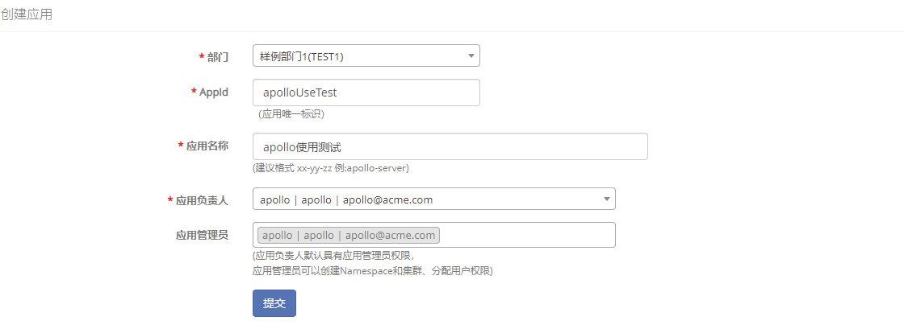

# 使用Apollo配置中心

## 使用样例项目

### 查看样例配置

1. 打开http://localhost:8070

> 


2. 输入用户名apollo，密码admin后登录

  

3. 点击创建应用，进行应用的设置

 

> 如果提示 <font color='red'>**系统出错，请重试或联系系统负责人**</font>，请稍后几秒钟重试一下，因为通过Eureka注册的服务有一个刷新的延时。
>
> 4. 创建后，界面如下：
>
>    

### 运行客户端程序

我们准备了一个简单的[Demo客户端](https://github.com/ctripcorp/apollo/blob/master/apollo-demo/src/main/java/com/ctrip/framework/apollo/demo/api/SimpleApolloConfigDemo.java)来演示从Apollo配置中心获取配置。

程序很简单，就是用户输入一个key的名字，程序会输出这个key对应的值。

如果没找到这个key，则输出undefined。

同时，客户端还会监听配置变化事件，一旦有变化就会输出变化的配置信息。

运行`./demo.sh client`启动Demo客户端，忽略前面的调试信息，可以看到如下提示：

```sh

Apollo Config Demo. Please input key to get the value. Input quit to exit.

>
```

输入`timeout`，会看到如下信息：

```sh

> timeout

> [SimpleApolloConfigDemo] Loading key : timeout with value: 100

```


> 如果运行客户端遇到问题，可以通过修改`client/log4j2.xml`中的level为DEBUG来查看更详细日志信息

> ```xml

> <logger name="com.ctrip.framework.apollo" additivity="false" level="trace">

>   <AppenderRef ref="Async" level="DEBUG"/>

> </logger>

> ```

### 修改配置并发布

1. 在配置界面点击timeout这一项的编辑按钮


2. 在弹出框中把值改成200并提交


3. 点击发布按钮，并填写发布信息


### 客户端查看修改后的值

如果客户端一直在运行的话，在配置发布后就会监听到配置变化，并输出修改的配置信息：

```sh

[SimpleApolloConfigDemo] Changes for namespace application

[SimpleApolloConfigDemo] Change - key: timeout, oldValue: 100, newValue: 200, changeType: MODIFIED

```

再次输入`timeout`查看对应的值，会看到如下信息：

```sh

> timeout

> [SimpleApolloConfigDemo] Loading key : timeout with value: 200

```

## 使用新的项目

### 应用接入Apollo

这部分可以参考[Java应用接入指南](zh/usage/java-sdk-user-guide)

### 运行客户端程序

由于使用了新的项目，所以客户端需要修改appId信息。

编辑`client/META-INF/app.properties`，修改app.id为你新创建的app id。

```properties

app.id=你的appId

```

运行`./demo.sh client`启动Demo客户端即可。
