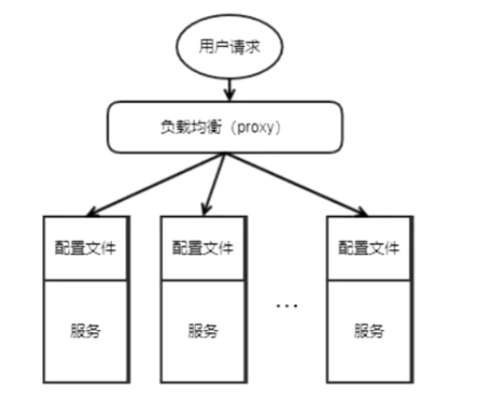
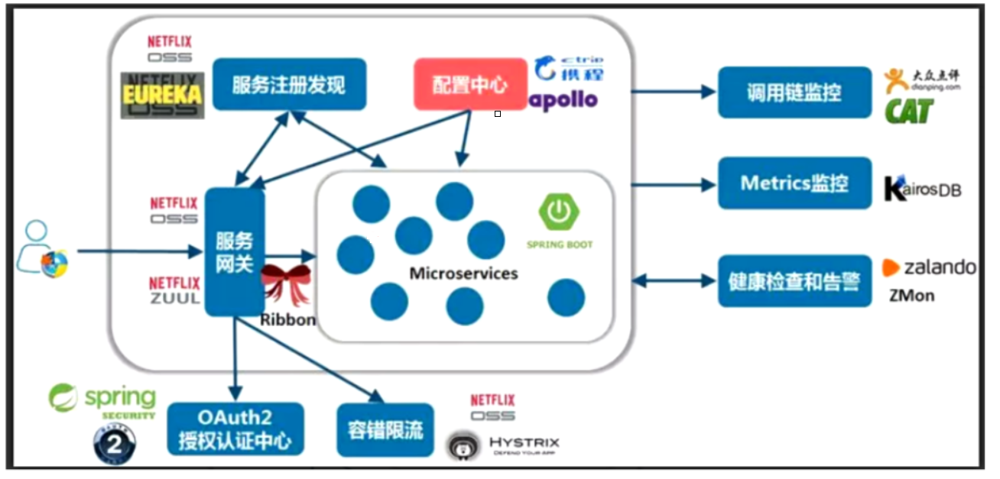
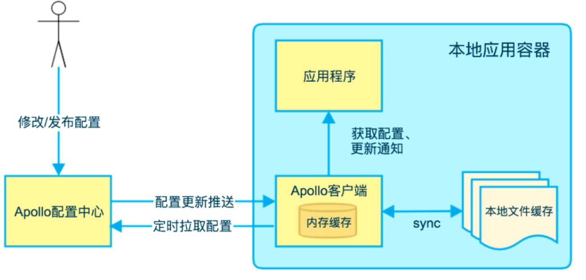
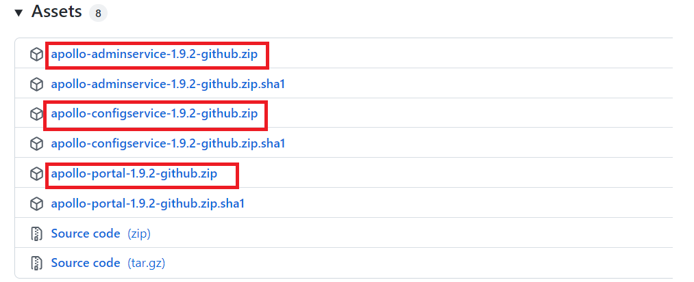
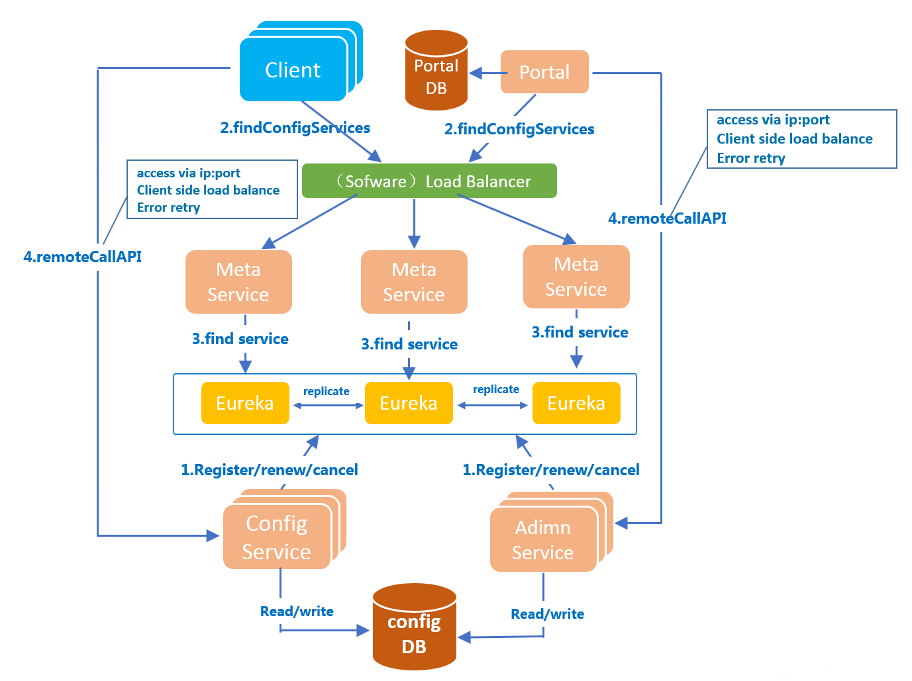
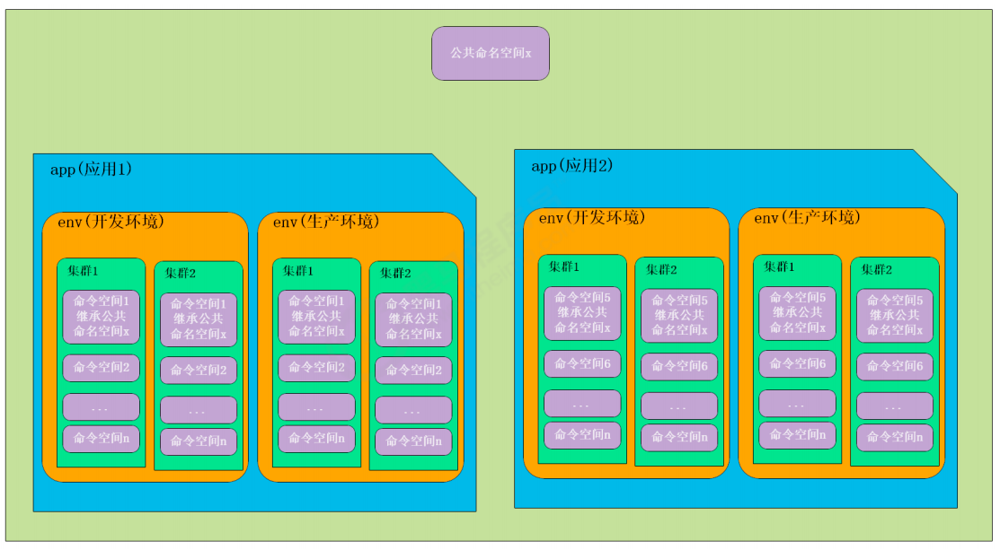

# Apollo简介

本章主要介绍Apollo式系统配置中心的使用方法和工作原理，并从实战出发讲解生产环境下的配置中心的构建方案，从Apollo的应用、原理、项目实战三方面进行讲解，通过学习本课程可以快速将Apollo配置中心集成到分布式系统中。

# 参考资料

http://www.pbteach.com/java/java_05_03/20210527/582534840956485632.html

https://www.jianshu.com/p/4dc449cdeb67

[官方中文文档](https://www.apolloconfig.com/#/zh/README)

https://blog.csdn.net/zjh_746140129/article/details/86179522

https://blog.csdn.net/qq_41432730/article/details/122268606

Elastic-job 介绍与使用

安装使用

https://blog.csdn.net/qq_41432730/article/details/122267782

https://blog.csdn.net/weixin_43303455/article/details/117824375

https://www.apolloconfig.com/#/zh/deployment/quick-start-docker?id=_12-%e4%b8%8b%e8%bd%bddocker-quick-start%e9%85%8d%e7%bd%ae%e6%96%87%e4%bb%b6

https://www.apolloconfig.com/#/zh/deployment/distributed-deployment-guide?id=_22-%e8%99%9a%e6%8b%9f%e6%9c%ba%e7%89%a9%e7%90%86%e6%9c%ba%e9%83%a8%e7%bd%b2

# 概念

## 什么是配置 

应用程序在<font color='red'>启动和运行的时候往往需要读取一些配置信息</font>，配置基本上伴随着应用程序的整个生命周期，比如：数据库连接参数、启动参数等。

配置主要有以下几个特点：

- **配置是独立于程序的只读变量**
  - 配置首先是独立于程序的，同一份程序在不同的配置下会有不同的行为；
  - 其次，配置对于程序是只读的，程序通过读取配置来改变自己的行为，但是程序不应该去改变配置；
  - 常见的配置有：DB Connection Str、Thread Pool Size、Buffer Size、Request Timeout、Feature Switch、Server Urls等。
- **配置伴随应用的整个生命周期**
  - 配置贯穿于应用的整个生命周期，应用在启动时通过读取配置来初始化，在运行时根据配置调整行为。比如：启动时需要读取服务的端口号、系统在运行过程中需要读取定时策略执行定时任务等。
- **配置可以有多种加载方式**
  - 常见的有程序<font color='red'>内部硬编码，配置文件，环境变量，启动参数，基于数据库</font>等
- **配置需要治理**
  - 权限控制
    - 由于配置能改变程序的行为，不正确的配置甚至能引起灾难，所以对配置的修改必须有比较完善的权限控制
  - 不同环境、集群配置管理：
    - <font color='red'>同一份程序在不同的环境（开发，测试，生产）、不同的集群（如不同的数据中心）经常需要有不同的配置</font>，所以需要有完善的环境、集群配置管理
  - 框架类组件配置管理
    - 还有一类比较特殊的配置 - 框架类组件配置，比如CAT客户端的配置。
    - 虽然这类框架类组件是由其他团队开发、维护，但是运行时是在业务实际应用内的，所以本质上可以认为框架类组件也是应用的一部分。
    - 这类组件对应的配置也需要有比较完善的管理方式。

## 什么是配置中心

 传统单体应用存在一些潜在缺陷：

* 随着规模的扩大，部署效率降低，团队协作效率差，系统可靠性变差，维护困难，新功能上线周期长等。


因此，迫切需要一种新的架构去解决这些问题，而微服务（ microservices ）架构正是当下一种流行的解法。

* 不过，解决一个问题的同时，往往会诞生出很多新的问题，所以微服务化的过程中伴随着很多的挑战，其中一个挑战就是有关服务（应用）配置的。
* 当系统从一个单体应用，<font color='red'>被拆分成分布式系统上一个个服务节点后，配置文件也必须跟着迁移（分割），这样配置就分散了，不仅如此，分散中还包含着冗余</font>，如下图：

 

配置中心<font color='red'>将配置从应用中剥离出来，统一管理，优雅的解决了配置的动态变更、持久化、运维成本等问题</font>。

* 应用自身既不需要去添加管理配置接口，也不需要自己去实现配置的持久化，更不需要引入“定时任务”以便降低运维成本。
* 总得来说，配置中心就是一种统一管理各种应用配置的基础服务组件。

 在系统架构中，配置中心是整个微服务基础架构体系中的一个组件，如下图，它的功能看上去并不起眼，无非就是配置的管理和存取，但它是整个微服务架构中不可或缺的一环。

 

 

 集中管理配置，那么就要将应用的配置作为一个单独的服务抽离出来了，同理也需要解决新的问题，比如：版本管理（为了支持回滚），权限管理等。

 总结一下，在传统巨型单体应用纷纷转向细粒度微服务架构的历史进程中，配置中心是微服务化不可缺少的一个系统组件，在这种背景下中心化的配置服务即配置中心应运而生，一个合格的配置中心需要满足：

- 配置项容易读取和修改
- 添加新配置简单直接
- 支持对配置的修改的检视以把控风险
- 可以查看配置修改的历史记录
- 不同部署环境支持隔离

# 主流配置中心

目前市面上用的比较多的配置中心有：

1. [Disconf](https://github.com/knightliao/disconf)

   2014年7月百度开源的配置管理中心，专注于各种「分布式系统配置管理」的「通用组件」和「通用平台」, 提供统一的「配置管理服务」。目前已经不再维护更新。

2. [Spring Cloud Config](https://github.com/spring-cloud/spring-cloud-config)

   2014年9月开源，Spring Cloud 生态组件，可以和Spring Cloud体系无缝整合。

3. [Apollo](https://github.com/ctripcorp/apollo)

   2016年5月，携程开源的配置管理中心，能够集中化管理应用不同环境、不同集群的配置，配置修改后能够实时推送到应用端，并且具备规范的权限、流程治理等特性，适用于微服务配置管理场景。

4. [Nacos](https://github.com/alibaba/nacos)

   2018年6月，阿里开源的配置中心，也可以做DNS和RPC的服务发现。

## 功能特性对比

由于Disconf不再维护，下面主要对比一下Spring Cloud Config、Apollo和Nacos。

| 功能点       | Spring Cloud Config    | Apollo                   | Nacos                    |
| :----------- | :--------------------- | :----------------------- | :----------------------- |
| 配置实时推送 | 支持(Spring Cloud Bus) | 支持(HTTP长轮询1s内)     | 支持(HTTP长轮询1s内)     |
| 版本管理     | 支持(Git)              | 支持                     | 支持                     |
| 配置回滚     | 支持(Git)              | 支持                     | 支持                     |
| 灰度发布     | 支持                   | 支持                     | 不支持                   |
| 权限管理     | 支持(依赖Git)          | 支持                     | 不支持                   |
| 多集群       | 支持                   | 支持                     | 支持                     |
| 多环境       | 支持                   | 支持                     | 支持                     |
| 监听查询     | 支持                   | 支持                     | 支持                     |
| 多语言       | 只支持Java             | 主流语言，提供了Open API | 主流语言，提供了Open API |
| 配置格式校验 | 不支持                 | 支持                     | 支持                     |
| 单机读(QPS)  | 7(限流所致)            | 9000                     | 15000                    |
| 单击写(QPS)  | 5(限流所致)            | 1100                     | 1800                     |
| 3节点读(QPS) | 21(限流所致)           | 27000                    | 45000                    |
| 3节点写(QPS) | 5限流所致()            | 3300                     | 5600                     |

## 总结

总的来看，Apollo和Nacos相对于Spring Cloud Config的生态支持更广，在配置管理流程上做的更好。Apollo相对于Nacos在配置管理做的更加全面，Nacos则使用起来相对比较简洁，在对性能要求比较高的大规模场景更适合。但对于一个开源项目的选型，项目上的人力投入（迭代进度、文档的完整性）、社区的活跃度（issue的数量和解决速度、Contributor数量、社群的交流频次等），这些因素也比较关键，考虑到Nacos开源时间不长和社区活跃度，所以从目前来看Apollo应该是最合适的配置中心选型。

# Apollo简介


**Apollo - A reliable configuration management system**

https://github.com/ctripcorp/apollo

Apollo（阿波罗）是携程框架部门研发的分布式配置中心，<font color='red'>能够集中化管理应用的不同环境、不同集群的配置，配置修改后能够实时推送到应用端</font>，并且具备规范的权限、流程治理等特性，适用于微服务配置管理场景。

Apollo包括服务端和客户端两部分：

服务端基于Spring Boot和Spring Cloud开发，打包后可以直接运行，不需要额外安装Tomcat等应用容器。

Java客户端不依赖任何框架，能够运行于所有Java运行时环境，同时对Spring/Spring Boot环境也有较好的支持。

## Apollo特性

Apollo作为一个有治理能力的配置发布平台，目前提供了以下的特性：

- **统一管理不同环境、不同集群的配置**
  - Apollo提供了一个统一界面集中式管理<font color='red'>不同环境（environment）、不同集群（cluster）、不同命名空间（namespace）的配置</font>。
  - 同一份代码部署在不同的集群，可以有不同的配置，比如zookeeper的地址等
  - 通过<font color='red'>命名空间（namespace）可以很方便地支持多个不同应用共享同一份配置，同时还允许应用对共享的配置进行覆盖</font>
- **配置修改实时生效（热发布）**
  - 用户在Apollo修改完配置并发布后，客户端能实时（1秒）接收到最新的配置，并通知到应用程序
- **版本发布管理**
  - 所有的配置发布都有版本概念，从而可以方便地支持配置的回滚
- **灰度发布**
  - 支持配置的灰度发布，比如点了发布后，只对部分应用实例生效，等观察一段时间没问题后再推给所有应用实例
- **权限管理、发布审核、操作审计**
  - 应用和配置的管理都有完善的权限管理机制，对配置的管理还分为了<font color='red'>编辑和发布</font>两个环节，从而减少人为的错误。
  - 所有的操作都有审计日志，可以方便地追踪问题
- **客户端配置信息监控**
  - 可以在界面上方便地看到配置在被哪些实例使用
- **提供Java和.Net原生客户端**
  - 提供了Java和.Net的原生客户端，方便应用集成
  - 支持Spring Placeholder, Annotation和Spring Boot的ConfigurationProperties，方便应用使用（需要Spring 3.1.1+）
  - 同时提供了Http接口，非Java和.Net应用也可以方便地使用
- **提供开放平台API**
  - Apollo自身提供了比较完善的统一配置管理界面，支持多环境、多数据中心配置管理、权限、流程治理等特性。不过Apollo出于通用性考虑，不会对配置的修改做过多限制，只要符合基本的格式就能保存，不会针对不同的配置值进行针对性的校验，如数据库用户名、密码，Redis服务地址等
  - 对于这类应用配置，Apollo支持应用方通过开放平台API在Apollo进行配置的修改和发布，并且具备完善的授权和权限控制

## 3 Apollo快速入门

## 执行流程



操作流程如下：

1、在Apollo配置中心修改配置

2、应用程序通过Apollo客户端从配置中心拉取配置信息

 用户通过Apollo配置中心修改或发布配置后，会有两种机制来保证应用程序来获取最新配置：

1. Apollo配置中心会向客户端<font color='red'>推送最新的配置</font>；
2. Apollo客户端会定时从Apollo配置中心<font color='red'>拉取最新的配置</font>。

通过以上两种机制共同来保证应用程序能及时获取到配置。

# 安装Apollo

## 运行时环境

Java

- Apollo服务端：1.8+
- Apollo客户端：1.7+

由于需要同时运行服务端和客户端，所以建议安装Java 1.8+。

MySQL

- 版本要求：5.6.5+

Apollo的表结构对`timestamp`使用了多个default声明，所以需要5.6.5以上版本。

## 下载配置

1. 访问Apollo的官方主页获取安装包：

   https://github.com/ctripcorp/apollo/tags

   

1. 打开v1.9.2发布链接，下载必须的安装包：https://github.com/apolloconfig/apollo/releases/tag/v1.9.2

    

2. 解压安装包后将apollo-configservice-1.3.0.jar, apollo-adminservice-1.3.0.jar, apollo-portal-1.3.0.jar放置于apollo目录下

## 创建数据库

Apollo服务端共需要两个数据库：`ApolloPortalDB`和`ApolloConfigDB`，ApolloPortalDB只需要在生产环境部署一个即可，而ApolloConfigDB需要在每个环境部署一套。

1. 创建ApolloPortalDB，sql脚本下载地址：[apolloportaldb.sql](https://github.com/apolloconfig/apollo/blob/v1.9.2/scripts/sql/apolloportaldb.sql)

   以MySQL原生客户端为例：

   ```
    source apollo/apolloportaldb.sql
   ```

2. 验证ApolloPortalDB

   导入成功后，可以通过执行以下sql语句来验证：

   ```
    select `Id`, `Key`, `Value`, `Comment` from `ApolloPortalDB`.`ServerConfig` limit 1;
   ```

   > 注：ApolloPortalDB只需要在生产环境部署一个即可

3. 创建ApolloConfigDB，sql脚本下载地址：[apolloconfigdb.sql](https://github.com/apolloconfig/apollo/blob/v1.9.2/scripts/sql/apolloconfigdb.sql)

   ```
    source apollo/apolloconfigdb.sql
   ```
   
4. 验证ApolloConfigDB

   导入成功后，可以通过执行以下sql语句来验证：

   ```
    select `Id`, `Key`, `Value`, `Comment` from `ApolloConfigDB`.`ServerConfig` limit 1;
   ```

## 启动Apollo

1. 确保端口未被占用

   Apollo默认会启动3个服务，分别使用8070, 8080, 8090端口，请确保这3个端口当前没有被使用

2. 启动apollo-configservice，在apollo目录下执行如下命令

   可通过-Dserver.port=8080修改默认端口

   ```
   java -Xms256m -Xmx256m -Dspring.datasource.url=jdbc:mysql://localhost:3306/ApolloConfigDB?characterEncoding=utf8 -Dspring.datasource.username=root -Dspring.datasource.password=pbteach0430 -jar apollo-configservice-1.3.0.jar
   ```

   

3. 启动apollo-adminservice

   可通过-Dserver.port=8090修改默认端口

   ```
    java -Xms256m -Xmx256m -Dspring.datasource.url=jdbc:mysql://localhost:3306/ApolloConfigDB?characterEncoding=utf8 -Dspring.datasource.username=root -Dspring.datasource.password=pbteach0430 -jar apollo-adminservice-1.3.0.jar
   ```

   

4. 启动apollo-portal

   可通过-Dserver.port=8070修改默认端口

   ```
   java -Xms256m -Xmx256m -Ddev_meta=http://localhost:8080/ -Dserver.port=8070 -Dspring.datasource.url=jdbc:mysql://localhost:3306/ApolloPortalDB?characterEncoding=utf8 -Dspring.datasource.username=root -Dspring.datasource.password=pbteach0430 -jar apollo-portal-1.3.0.jar
   ```

   

5. 也可以使用提供的runApollo.bat快速启动三个服务（修改数据库连接地址，数据库以及密码）

   ```
    echo
    
    set url="localhost:3306"
    set username="root"
    set password="123"
    
    start "configService" java -Xms256m -Xmx256m -Dapollo_profile=github -Dspring.datasource.url=jdbc:mysql://%url%/ApolloConfigDB?characterEncoding=utf8 -Dspring.datasource.username=%username% -Dspring.datasource.password=%password% -Dlogging.file=.\logs\apollo-configservice.log -jar .\apollo-configservice-1.3.0.jar
    start "adminService" java -Xms256m -Xmx256m -Dapollo_profile=github -Dspring.datasource.url=jdbc:mysql://%url%/ApolloConfigDB?characterEncoding=utf8 -Dspring.datasource.username=%username% -Dspring.datasource.password=%password% -Dlogging.file=.\logs\apollo-adminservice.log -jar .\apollo-adminservice-1.3.0.jar
    start "ApolloPortal" java -Xms256m -Xmx256m -Dapollo_profile=github,auth -Ddev_meta=http://localhost:8080/ -Dserver.port=8070 -Dspring.datasource.url=jdbc:mysql://%url%/ApolloPortalDB?characterEncoding=utf8 -Dspring.datasource.username=%username% -Dspring.datasource.password=%password% -Dlogging.file=.\logs\apollo-portal.log -jar .\apollo-portal-1.3.0.jar
   ```

6. 运行runApollo.bat即可启动Apollo

7. 待启动成功后，访问[管理页面](http://localhost:8070/) apollo/admin

   

 

## 代码实现

### 发布配置

1. 打开[apollo](http://localhost:8070/) ：新建项目apollo-quickstart

   

2. 新建配置项sms.enable

   

   确认提交配置项

    

3. 发布配置项


#### 3.3.2 应用读取配置

1、新建Maven工程

打开idea，新建apollo-quickstart项目


打开pom.xml文件添加apollo依赖，配置JDK为1.8

```
 <?xml version="1.0" encoding="UTF-8"?>
 <project xmlns="http://maven.apache.org/POM/4.0.0"
          xmlns:xsi="http://www.w3.org/2001/XMLSchema-instance"
          xsi:schemaLocation="http://maven.apache.org/POM/4.0.0 http://maven.apache.org/xsd/maven-4.0.0.xsd">
     <modelVersion>4.0.0</modelVersion>
 
     <groupId>com.pbteach</groupId>
     <artifactId>apollo-quickstart</artifactId>
     <version>1.0-SNAPSHOT</version>
 
     <properties>
         <java.version>1.8</java.version>
     </properties>
 
     <dependencies>
         <dependency>
             <groupId>com.ctrip.framework.apollo</groupId>
             <artifactId>apollo-client</artifactId>
             <version>1.1.0</version>
         </dependency>
 
         <dependency>
             <groupId>org.slf4j</groupId>
             <artifactId>slf4j-simple</artifactId>
             <version>1.7.28</version>
         </dependency>
     </dependencies>
     <build>
         <plugins>
             <plugin>
                 <groupId>org.apache.maven.plugins</groupId>
                 <artifactId>maven-compiler-plugin</artifactId>
                 <configuration>
                     <source>8</source>
                     <target>8</target>
                 </configuration>
             </plugin>
         </plugins>
     </build>
 </project>
```

 

2、编写测试类GetConfigTest

新建com.pbteach.apollo.quickstart包，添加测试类GetConfigTest

添加如下代码读取sms.enable的值

```
 package com.pbteach.apollo.quickstart;
 
 public class GetConfigTest {
 
 // VM options:
 // -Dapp.id=apollo-quickstart -Denv=DEV -Ddev_meta=http://localhost:8080
 public static void main(String[] args) {
 Config config = ConfigService.getAppConfig();
 String someKey = "sms.enable";
 String value = config.getProperty(someKey, null);
 System.out.println("sms.enable: " + value);
 }
 }
```

3、测试

配置VM options，设置系统属性：

```
 -Dapp.id=apollo-quickstart -Denv=DEV -Ddev_meta=http://localhost:8080
```


运行GetConfigTest，打开控制台，观察输出结果


#### 3.3.4 修改配置

1. 修改sms.enable的值为false

   

2. 再次运行GetConfigTest，可以看到输出结果已为false

   


#### 3.3.5 热发布

1. 修改代码为每3秒获取一次

   ```
    public class GetConfigTest {
    
    public static void main(String[] args) throws InterruptedException {
    Config config = ConfigService.getAppConfig();
    String someKey = "sms.enable";
    
    while (true) {
    String value = config.getProperty(someKey, null);
    System.out.printf("now: %s, sms.enable: %s%n", LocalDateTime.now().toString(), value);
    Thread.sleep(3000L);
    }
    }
    }
   ```

2. 运行GetConfigTest观察输出结果

   

3. 在Apollo管理界面修改配置项

   

4. 发布配置

   

5. 在控制台查看详细情况：可以看到程序获取的sms.enable的值已由false变成了修改后的true

   

 

# Apollo应用

## Apollo工作原理

下图是Apollo架构模块的概览

 

### 各模块职责

上图简要描述了Apollo的总体设计，从下往上看：

**四个核心模块及其主要功能**

1. Config Service

* 提供配置的读取、推送等功能
* 服务于Apollo客户端

2. Admin Service

* 提供配置的修改、发布等功能
* 服务于Apollo Portal（管理界面）

3. Client

* 为应用获取配置，支持实时更新
* 通过Meta Server获取Config Service的服务列表
* 使用客户端软负载SLB方式调用Config Service

4. Portal

* 配置管理界面
  通过Meta Server获取Admin Service的服务列表
* 使用客户端软负载SLB方式调用AdminService

**三个辅助服务发现模块**

1. Eureka

* 用于服务发现和注册
* Config Service和Admin Service都是多实例、无状态部署，所以需要将自己注册到Eureka中并保持心跳
* 与Config Service住在一起部署

2. Meta Server

* Client通过域名访问Meta Server获取Config Service服务列表（IP+Port）
* Portal通过域名访问Meta Server获取Admin Service服务列表（IP+Port）
* 在Eureka之上架了一层Meta Server用于封装Eureka的服务发现接口，Meta Server相当于一个Eureka Proxy
* 与Config Service住在一起部署

3. NginxLB

* 通过与域名系统配合，完成以下功能
* 协助Portal访问MetaServer获取Admin Service服务列表
* 协助Client访问MetaServer获取Config Service服务列表
* 协助用户访问Portal进行配置管理

### 分步执行流程

1. Apollo启动后，Config/Admin Service会自动注册到Eureka服务注册中心，并定期发送保活心跳；
2. Apollo Client和Portal管理端通过配置的Meta Server的域名地址经由Software Load Balancer(软件负载均衡器)进行负载均衡后分配到某一个Meta Server；
3. Meta Server从Eureka获取Config Service和Admin Service的服务信息，相当于是一个Eureka Client；
4. Meta Server获取Config Service和Admin Service（IP+Port）失败后会进行重试；
5. 获取到正确的Config Service和Admin Service的服务信息后，Apollo Client通过Config Service为应用提供配置获取、实时更新等功能；Apollo Portal管理端通过Admin Service提供配置新增、修改、发布等功能。

## 核心概念

1. application (应用)

   * 实际使用配置的应用，Apollo客户端在运行时需要知道当前应用是谁，从而可以去获取对应的配置。

   * 关键字：appId

2. environment (环境)

   * 配置对应的环境，Apollo客户端在运行时需要知道当前应用处于哪个环境，从而可以去获取应用的配置
   * 关键字：env
   
3. cluster (集群)

   * 一个应用下不同实例的分组，比如典型的可以按照数据中心分，把上海机房的应用实例分为一个集群，把北京机房的应用实例分为另一个集群。

   * 关键字：cluster

4. namespace (命名空间)

   * 一个应用下不同配置的分组，可以简单地把namespace类比为文件，不同类型的配置存放在不同的文件中，如数据库配置文件，RPC配置文件，应用自身的配置文件等

   * 关键字：namespaces

它们的关系如下图所示：

 

 


### 4.3 项目管理


#### 4.3.1 基础设置

1. 部门管理

   apollo 默认部门有两个。要增加自己的部门，可在系统参数中修改：

   - 进入系统参数设置

   

   - 输入key查询已存在的部门设置：organizations

     

   - 修改value值来添加新部门，下面添加一个微服务部门：

     ```
      [{"orgId":"TEST1","orgName":"样例部门1"},{"orgId":"TEST2","orgName":"样例部门2"},{"orgId":"micro_service","orgName":"微服务部门"}]
     ```

2. 添加用户

   apollo默认提供一个超级管理员: apollo，可以自行添加用户

   - 新建用户张三

   

   


#### 4.3.2 创建项目

1. 打开apollo-portal主页：http://localhost:8070/

2. 点击“创建项目”：account-service

   

3. 输入项目信息

   - 部门：选择应用所在的部门
   - 应用AppId：用来标识应用身份的唯一id，格式为string，需要和项目配置文件applications.properties中配置的app.id对应
   - 应用名称：应用名，仅用于界面展示
   - 应用负责人：选择的人默认会成为该项目的管理员，具备项目权限管理、集群创建、Namespace创建等权限

   

4. 点击提交

创建成功后，会自动跳转到项目首页


1. 赋予之前添加的用户张三管理account-service服务的权限

   - 使用管理员apollo将指定项目授权给用户张三

     

   - 将修改和发布权限都授权给张三

     

   - 使用zhangsan登录，查看项目配置

     

   - 点击account-service即可管理配置


#### 4.3.3 删除项目

如果要删除整个项目，点击右上角的“管理员工具--》删除应用、集群...”

首先查询出要删除的项目，点击“删除应用”


### 4.4 配置管理

下边在account-service项目中进行配置。


#### 4.4.1 添加发布配置项

1. 通过表格模式添加配置

   - 点击新增配置

     

   - 输入配置项：sms.enable，点击提交

     

2. 通过文本模式编辑

   Apollo除了支持表格模式，逐个添加、修改配置外，还提供文本模式批量添加、修改。 这个对于从已有的properties文件迁移尤其有用

   - 切换到文本编辑模式

     

   - 输入配置项，并点击提交修改

     

3. 发布配置

   


#### 4.4.2 修改配置

1. 找到对应的配置项，点击修改

   

2. 修改为需要的值，点击提交

3. 发布配置


#### 4.4.3 删除配置

1. 找到需要删除的配置项，点击删除

   

2. 确认删除后，点击发布

   


#### 4.4.4 添加Namespace

Namespace作为配置的分类，可当成一个配置文件。

以添加rocketmq配置为例，添加“spring-rocketmq” Namespace配置rocketmq相关信息。

1. 添加项目私有Namespace：spring-rocketmq

   进入项目首页，点击左下脚的“添加Namespace”，共包括两项：关联公共Namespace和创建Namespace，这里选择“创建Namespace”

   

2. 添加配置项

   ```
    rocketmq.name-server = 127.0.0.1:9876
    rocketmq.producer.group = PID_ACCOUNT
   ```

   

3. 发布配置

   


####  


#### 4.4.5 公共配置

##### 4.4.5.1 添加公共Namespace

在项目开发中，有一些配置可能是通用的，我们可以通过把这些通用的配置放到公共的Namespace中，这样其他项目要使用时可以直接添加需要的Namespace

1. 新建common-template项目

   

2. 添加公共Namespace：spring-boot-http

   进入common-template项目管理页面：[http://localhost:8070/config.html?#/appid=common-template](http://localhost:8070/config.html#/appid=common-template)

   

   

3. 添加配置项并发布

   ```
    spring.http.encoding.enabled = true
    spring.http.encoding.charset = UTF-8
    spring.http.encoding.force = true
    server.tomcat.remote_ip_header = x-forwarded-for
    server.tomcat.protocol_header = x-forwarded-proto
    server.use-forward-headers = true
    server.servlet.context-path = /
   ```

   

 

##### 4.4.5.2 关联公共Namespace

1. 打开之前创建的account-service项目

2. 点击左侧的添加Namespace

   

3. 添加Namespace

   

4. 根据需求可以覆盖引入公共Namespace中的配置，下面以覆盖server.servlet.context-path为例

   

5. 修改server.servlet.context-path为：/account-service

   

6. 发布修改的配置项

   


### 4.5 多项目配置

通常一个分布式系统包括多个项目，所以需要多个项目，下边以一个P2P金融的项目为例，添加交易中心微服务transaction-service。

1. 添加交易中心微服务transaction-service

   

2. 关联公共Namespace

   任务应用都可以关联公共Namespace。

   

3. 覆盖配置，修改交易中心微服务的context-path为：/transaction

   

4. 发布修改后的配置

    

 


### 4.6 集群管理

在有些情况下，应用有需求对不同的集群做不同的配置，比如部署在A机房的应用连接的RocketMQ服务器地址和部署在B机房的应用连接的RocketMQ服务器地址不一样。另外在项目开发过程中，也可为不同的开发人员创建不同的集群来满足开发人员的自定义配置。


#### 4.6.1 创建集群

1. 点击页面左侧的“添加集群”按钮

   

2. 输入集群名称SHAJQ，选择环境并提交：添加上海金桥数据中心为例

   

3. 切换到对应的集群，修改配置并发布即可

   


#### 4.6.2 同步集群配置

同步集群的配置是指在同一个应用中拷贝某个环境下的集群的配置到目标环境下的目标集群。

1. 从其他集群同步已有配置到新集群

   - 切换到原有集群

   - 展开要同步的Namespace，点击同步配置

     

   - 选择同步到的新集群，再选择要同步的配置

     

   - 同步完成后，切换到SHAJQ集群，发布配置

     


#### 4.6.3 读取配置

读取某个集群的配置，需要启动应用时指定具体的应用、环境和集群。

-Dapp.id=应用名称

-Denv=环境名称

-Dapollo.cluster=集群名称 

-D环境_meta=meta地址

```
-Dapp.id=account-service -Denv=DEV -Dapollo.cluster=SHAJQ -Ddev_meta=http://localhost:8080 
```

 

 


### 4.7 配置发布原理

在配置中心中，一个重要的功能就是配置发布后实时推送到客户端。下面我们简要看一下这块是怎么设计实现的。


上图简要描述了配置发布的主要过程：

1. 用户在Portal操作配置发布
2. Portal调用Admin Service的接口操作发布
3. Admin Service发布配置后，发送ReleaseMessage给各个Config Service
4. Config Service收到ReleaseMessage后，通知对应的客户端


#### 4.7.1 发送ReleaseMessage

Admin Service在配置发布后，需要通知所有的Config Service有配置发布，从而Config Service可以通知对应的客户端来拉取最新的配置。

从概念上来看，这是一个典型的消息使用场景，Admin Service作为producer（生产者）发出消息，各个Config Service作为consumer（消费者）消费消息。通过一个消息队列组件（Message Queue）就能很好的实现Admin Service和Config Service的解耦。

在实现上，考虑到Apollo的实际使用场景，以及为了尽可能减少外部依赖，我们没有采用外部的消息中间件，而是通过数据库实现了一个简单的消息队列。

具体实现方式如下：

1. Admin Service在配置发布后会往ReleaseMessage表插入一条消息记录，消息内容就是配置发布的AppId+Cluster+Namespace

   ```
    SELECT * FROM ApolloConfigDB.ReleaseMessage
   ```

   

   消息发送类：[DatabaseMessageSende](https://github.com/ctripcorp/apollo/blob/master/apollo-biz/src/main/java/com/ctrip/framework/apollo/biz/message/DatabaseMessageSender.java)

   

2. Config Service有一个线程会每秒扫描一次ReleaseMessage表，看看是否有新的消息记录

   消息扫描类：[ReleaseMessageScanner](https://github.com/ctripcorp/apollo/blob/master/apollo-biz/src/main/java/com/ctrip/framework/apollo/biz/message/ReleaseMessageScanner.java)

   

3. Config Service如果发现有新的消息记录，那么就会通知到所有的消息监听器

   

   然后调用消息监听类的handleMessage方法：[NotificationControllerV2](https://github.com/ctripcorp/apollo/blob/master/apollo-configservice/src/main/java/com/ctrip/framework/apollo/configservice/controller/NotificationControllerV2.java)

   

4. NotificationControllerV2得到配置发布的AppId+Cluster+Namespace后，会通知对应的客户端


#### 4.7.2 Config Service通知客户端

上一节中简要描述了NotificationControllerV2是如何得知有配置发布的，那NotificationControllerV2在得知有配置发布后是如何通知到客户端的呢？

实现方式如下：

1. 客户端会发起一个Http请求到Config Service的`notifications/v2`接口[NotificationControllerV2](https://github.com/ctripcorp/apollo/blob/master/apollo-configservice/src/main/java/com/ctrip/framework/apollo/configservice/controller/NotificationControllerV2.java)

   

   客户端发送请求类：[RemoteConfigLongPollService](https://github.com/ctripcorp/apollo/blob/master/apollo-client/src/main/java/com/ctrip/framework/apollo/internals/RemoteConfigLongPollService.java)

   

2. NotificationControllerV2不会立即返回结果，而是把请求挂起。考虑到会有数万客户端向服务端发起长连，因此在服务端使用了async servlet([Spring DeferredResult](http://docs.spring.io/spring/docs/current/javadoc-api/org/springframework/web/context/request/async/DeferredResult.html))来服务Http Long Polling请求。

3. 如果在60秒内没有该客户端关心的配置发布，那么会返回Http状态码304给客户端。

4. 如果有该客户端关心的配置发布，NotificationControllerV2会调用DeferredResult的[setResult](http://docs.spring.io/spring/docs/current/javadoc-api/org/springframework/web/context/request/async/DeferredResult.html#setResult-T-)方法，传入有配置变化的namespace信息，同时该请求会立即返回。客户端从返回的结果中获取到配置变化的namespace后，会立即请求Config Service获取该namespace的最新配置。


#### 4.7.3 客户端读取设计

除了之前介绍的客户端和服务端保持一个长连接，从而能第一时间获得配置更新的推送外，客户端还会定时从Apollo配置中心服务端拉取应用的最新配置。

- 这是一个备用机制，为了防止推送机制失效导致配置不更新
- 客户端定时拉取会上报本地版本，所以一般情况下，对于定时拉取的操作，服务端都会返回304 - Not Modified
- 定时频率默认为每5分钟拉取一次，客户端也可以通过在运行时指定System Property: `apollo.refreshInterval`来覆盖，单位为分钟

 


## 5 Apollo应用于分布式系统

在微服务架构模式下，项目往往会切分成多个微服务，下面将以万信金融P2P项目为例演示如何在项目中使用。


### 5.1 项目场景介绍


#### 5.1.1 项目概述

 万信金融是一款面向互联网大众提供的理财服务和个人消费信贷服务的金融平台，依托大数据风控技术，为用户提供方便、快捷、安心的P2P金融服务。本项目包括交易平台和业务支撑两个部分，交易平台主要实现理财服务，包括：借钱、出借等模块，业务支撑包括：标的管理、对账管理、风控管理等模块。项目采用先进的互联网技术进行研发，保证了P2P双方交易的安全性、快捷性及稳定性。


#### 5.1.2 各微服务介绍

本章节仅仅是为了演示配置中心，所以摘取了部分微服务，如下：

用户中心服务(consumer-service)：为借款人和投资人提供用户账户管理服务，包括：注册、开户、充值、提现等

UAA认证服务(uaa-service)：为用户中心的用户提供认证服务

统一账户服务(account-service)：对借款人和投资人的登录平台账号进行管理，包括：注册账号、账号权限管理等

交易中心(transaction-service)：负责P2P平台用户发标和投标功能


### 5.2 Spring Boot应用集成

下面以集成统一账户服务(account-service)为例


#### 5.2.1 导入工程

参考account-service、transaction-service、uaa-service、consumer-service工程，手动创建这几个微服务。

每个工程必须添加依赖：

```
 <dependency>
  <groupId>com.ctrip.framework.apollo</groupId>
  <artifactId>apollo-client</artifactId>
  <version>1.1.0</version>
 </dependency>
```

下边是account-service依赖，其它工程参考“资料”下的“微服务”。

```
 <?xml version="1.0" encoding="UTF-8"?>
 <project xmlns="http://maven.apache.org/POM/4.0.0" xmlns:xsi="http://www.w3.org/2001/XMLSchema-instance"
          xsi:schemaLocation="http://maven.apache.org/POM/4.0.0 http://maven.apache.org/xsd/maven-4.0.0.xsd">
    <modelVersion>4.0.0</modelVersion>
    <parent>
        <groupId>org.springframework.boot</groupId>
        <artifactId>spring-boot-starter-parent</artifactId>
        <version>2.1.3.RELEASE</version>
        <relativePath/> <!-- lookup parent from repository -->
    </parent>
    <groupId>com.pbteach</groupId>
    <artifactId>account-service</artifactId>
    <version>0.0.1-SNAPSHOT</version>
 
    <properties>
        <java.version>1.8</java.version>
    </properties>
 
    <dependencies>
        <dependency>
            <groupId>org.springframework.boot</groupId>
            <artifactId>spring-boot-starter</artifactId>
            <exclusions>
                <exclusion>
                    <groupId>org.springframework.boot</groupId>
                    <artifactId>spring-boot-starter-logging</artifactId>
                </exclusion>
            </exclusions>
        </dependency>
 
        <dependency>
            <groupId>org.springframework.boot</groupId>
            <artifactId>spring-boot-starter-log4j2</artifactId>
        </dependency>
 
        <dependency>
            <groupId>org.springframework.boot</groupId>
            <artifactId>spring-boot-starter-web</artifactId>
        </dependency>
 
        <dependency>
            <groupId>org.springframework.boot</groupId>
            <artifactId>spring-boot-configuration-processor</artifactId>
            <optional>true</optional>
        </dependency>
 
        <dependency>
            <groupId>com.ctrip.framework.apollo</groupId>
            <artifactId>apollo-client</artifactId>
            <version>1.1.0</version>
        </dependency>
 
    </dependencies>
 
 </project>
 
```

 


#### 5.2.2 必选配置

1. AppId：在Spring Boot application.properties或application.yml中配置

   application.properties

   ```
    app.id=account-service
   ```

   application.yml

   ```
    app:
    id: account-service
   ```

2. apollo.bootstrap

   集成springboot，开启apollo.bootstrap，指定namespace

   例子：

   ```
    apollo.bootstrap.enabled = true
    apollo.bootstrap.namespaces = application,micro_service.spring-boot-http,spring-rocketmq,micro_service.spring-boot-druid
    
   ```

3. Apollo Meta Server

   Apollo支持应用在不同的环境有不同的配置，常用的指定方式有如下两种：

   - 第一种：通过Java System Property的apollo.meta：`-Dapollo.meta=http://localhost:8080`

   - 第二种：在resources目录下新建apollo-env.properties文件

     ```
      dev.meta=http://localhost:8080
      pro.meta=http://localhost:8081
     ```

4. 本地缓存路径

   Apollo客户端会把从服务端获取到的配置在本地文件系统缓存一份，用于在遇到服务不可用，或网络不通的时候，依然能从本地恢复配置，不影响应用正常运行。本地配置文件会以下面的文件名格式放置于配置的本地缓存路径下：{appId}+{cluster}+{namespace}.properties

   

   可以通过如下方式指定缓存路径，通过Java System Property的apollo.cacheDir：

   ```
    -Dapollo.cacheDir=/opt/data/apollo-config
   ```

5. Environment

   通过Java System Property的env来指定环境：`-Denv=DEV`

6. Cluster（集群）

   通过Java System Property的apollo.cluste来指定集群：`-Dapollo.cluster=DEFAULT`

   也可以选择使用之前新建的SHAJQ集群：`-Dapollo.cluster=SHAJQ`

7. 完整的VM Options如下：

   ```
    -Denv=DEV -Dapollo.cacheDir=/opt/data/apollo-config -Dapollo.cluster=DEFAULT
   ```

   

 


#### 5.2.3 启用配置

在咱们应用的启动类添加`@EnableApolloConfig`注解即可：

```
 @SpringBootApplication(scanBasePackages = "com.pbteach.account")
 @EnableApolloConfig
 public class AccountApplication {
 
 public static void main(String[] args) {
 SpringApplication.run(AccountApplication.class, args);
 }
 }
```


#### 5.2.4 应用配置

1. 将local-config/account.properties中的配置添加到apollo中

   ```
   swagger.enable=true
   sms.enable=true
   
   spring.http.encoding.charset=UTF-8
   spring.http.encoding.force=true
   spring.http.encoding.enabled=true
   server.use-forward-headers=true
   server.tomcat.protocol_header=x-forwarded-proto
   server.servlet.context-path=/account-service
   server.tomcat.remote_ip_header=x-forwarded-for
   
   spring.datasource.driver-class-name=com.mysql.cj.jdbc.Driver
   spring.datasource.druid.stat-view-servlet.allow=127.0.0.1,192.168.163.1
   spring.datasource.druid.web-stat-filter.session-stat-enable=false
   spring.datasource.druid.max-pool-prepared-statement-per-connection-size=20
   spring.datasource.druid.max-active=20
   spring.datasource.druid.stat-view-servlet.reset-enable=false
   spring.datasource.druid.validation-query=SELECT 1 FROM DUAL
   spring.datasource.druid.stat-view-servlet.enabled=true
   spring.datasource.druid.web-stat-filter.enabled=true
   spring.datasource.druid.stat-view-servlet.url-pattern=/druid/*
   spring.datasource.druid.stat-view-servlet.deny=192.168.1.73
   spring.datasource.url=jdbc\:mysql\://127.0.0.1\:3306/p2p_account?useUnicode\=true
   spring.datasource.druid.filters=config,stat,wall,log4j2
   spring.datasource.druid.test-on-return=false
   spring.datasource.druid.web-stat-filter.profile-enable=true
   spring.datasource.druid.initial-size=5
   spring.datasource.druid.min-idle=5
   spring.datasource.druid.max-wait=60000
   spring.datasource.druid.web-stat-filter.session-stat-max-count=1000
   spring.datasource.druid.pool-prepared-statements=true
   spring.datasource.druid.test-while-idle=true
   spring.datasource.password=pbteach0430
   spring.datasource.username=root
   spring.datasource.druid.stat-view-servlet.login-password=admin
   spring.datasource.druid.stat-view-servlet.login-username=admin
   spring.datasource.druid.web-stat-filter.url-pattern=/*
   spring.datasource.druid.time-between-eviction-runs-millis=60000
   spring.datasource.druid.min-evictable-idle-time-millis=300000
   spring.datasource.druid.test-on-borrow=false
   spring.datasource.druid.web-stat-filter.principal-session-name=admin
   spring.datasource.druid.filter.stat.log-slow-sql=true
   spring.datasource.druid.web-stat-filter.principal-cookie-name=admin
   spring.datasource.type=com.alibaba.druid.pool.DruidDataSource
   spring.datasource.druid.aop-patterns=com.pbteach.wanxinp2p.*.service.*
   spring.datasource.druid.filter.stat.slow-sql-millis=1
   spring.datasource.druid.web-stat-filter.exclusions=*.js,*.gif,*.jpg,*.png,*.css,*.ico,/druid/*
   ```

    

2. spring-http命名空间在之前已通过关联公共命名空间添加好了，现在来添加spring-boot-druid命名空间

   

3. 添加本地文件中的配置到对应的命名空间，然后发布配置

   

4. 在account-service/src/main/resources/application.properties中配置apollo.bootstrap.namespaces需要引入的命名空间

   ```
    app.id=account-service
    apollo.bootstrap.enabled = true
    apollo.bootstrap.namespaces = application,micro_service.spring-boot-http,spring-rocketmq,spring-boot-druid
    
    server.port=63000
   ```


#### 5.2.5 读取配置

1. 启动应用

   

2. 访问：http://127.0.0.1:63000/account-service/hi，确认Spring Boot中配置的context-path是否生效

   

   通过/account-service能正常访问，说明apollo的配置已生效

   

3. 确认spring-boot-druid配置

   - 为了快速确认可以在AccountController中通过@Value获取来验证

     ```
     	@GetMapping("/db-url")
     	public String getDBConfig(@Value("${spring.datasource.url}") String url) {
     return url;
     	}
     ```

   - 访问http://127.0.0.1:63000/account-service/db-url，显示结果

     


#### 5.3.6 创建其它项目

参考account-service将其它项目也创建完成。

 


### 5.4 生产环境部署

当一个项目要上线部署到生产环境时，项目的配置比如数据库连接、RocketMQ地址等都会发生变化，这时候就需要通过Apollo为生产环境添加自己的配置。


#### 5.4.1 企业部署方案

在企业中常用的部署方案为：Apollo-adminservice和Apollo-configservice两个服务分别在线上环境(pro)，仿真环境(uat)和开发环境(dev)各部署一套，Apollo-portal做为管理端只部署一套，统一管理上述三套环境。

具体如下图所示：


下面以添加生产环境部署为例


#### 5.4.2 创建数据库

创建生产环境的ApolloConfigDB：每添加一套环境就需要部署一套ApolloConfgService和ApolloAdminService

source apollo/ApolloConfigDB_PRO__initialization.sql


#### 5.4.3 配置启动参数

1. 设置生产环境数据库连接
2. 设置ApolloConfigService端口为：8081，ApolloAdminService端口为8091

```
echo

set url="localhost:3306"
set username="root"
set password="mysqlpwd"

start "configService-PRO" java -Dserver.port=8081 -Xms256m -Xmx256m -Dapollo_profile=github -Dspring.datasource.url=jdbc:mysql://%url%/ApolloConfigDBPRO?characterEncoding=utf8 -Dspring.datasource.username=%username% -Dspring.datasource.password=%password% -Dlogging.file=.\logs\apollo-configservice.log -jar .\apollo-configservice-1.3.0.jar
start "adminService-PRO" java -Dserver.port=8091 -Xms256m -Xmx256m -Dapollo_profile=github -Dspring.datasource.url=jdbc:mysql://%url%/ApolloConfigDBPRO?characterEncoding=utf8 -Dspring.datasource.username=%username% -Dspring.datasource.password=%password% -Dlogging.file=.\logs\apollo-adminservice.log -jar .\apollo-adminservice-1.3.0.jar
```

1. 运行runApollo-PRO.bat


#### 5.4.4 修改Eureka地址

更新生产环境Apollo的Eureka地址：

```
USE ApolloConfigDBPRO;

UPDATE ServerConfig SET `Value` = "http://localhost:8081/eureka/" WHERE `key` = "eureka.service.url";
```


#### 5.4.5 调整ApolloPortal服务配置

服务配置项统一存储在ApolloPortalDB.ServerConfig表中，可以通过`管理员工具 - 系统参数`页面进行配置：apollo.portal.envs - 可支持的环境列表


默认值是dev，如果portal需要管理多个环境的话，以逗号分隔即可（大小写不敏感），如：

```
 dev,pro
```


#### 5.4.6 启动ApolloPortal

Apollo Portal需要在不同的环境访问不同的meta service(apollo-configservice)地址，所以我们需要在配置中提供这些信息。

```
 -Ddev_meta=http://localhost:8080/ -Dpro_meta=http://localhost:8081/
```

1. 关闭之前启动的ApolloPortal服务，使用runApolloPortal.bat启动多环境配置

   ```
    echo
    
    set url="localhost:3306"
    set username="root"
    set password="123"
    
    start "ApolloPortal" java -Xms256m -Xmx256m -Dapollo_profile=github,auth -Ddev_meta=http://localhost:8080/ -Dpro_meta=http://localhost:8081/ -Dserver.port=8070 -Dspring.datasource.url=jdbc:mysql://%url%/ApolloPortalDB?characterEncoding=utf8 -Dspring.datasource.username=%username% -Dspring.datasource.password=%password% -Dlogging.file=.\logs\apollo-portal.log -jar .\apollo-portal-1.3.0.jar
   ```

2. 启动之后，点击account-service服务配置后会提示环境缺失，此时需要补全上边新增生产环境的配置

   

3. 点击补缺环境

   

4. 补缺过生产环境后，切换到PRO环境后会提示有Namespace缺失，点击补缺

   

   

5. 从dev环境同步配置到pro

   

   


#### 5.4.7 验证配置

1. 同步完成后，切换到pro环境，修改生产环境rocketmq地址后发布配置

   

2. 配置项目使用pro环境，测试配置是否生效

   - 在apollo-env.properties中增加pro.meta=[http://localhost:8081](http://localhost:8081/)

   - 修改account-service启动参数为：-Denv=pro

     ```
      -Denv=pro -Dapollo.cacheDir=/opt/data/apollo-config -Dapollo.cluster=DEFAULT
     ```

   - 访问http://127.0.0.1:63000/account-service/mq 验证RocketMQ地址是否为上边设置的PRO环境的值

     


### 5.5 灰度发布


#### 5.5.1 定义

 灰度发布是指在黑与白之间，能够平滑过渡的一种发布方式。在其上可以进行A/B testing，即让一部分用户继续用产品特性A，一部分用户开始用产品特性B，如果用户对B没有什么反对意见，那么逐步扩大范围，把所有用户都迁移到B上面来。


#### 5.5.2 Apollo实现的功能

1. 对于一些对程序有比较大影响的配置，可以先在一个或者多个实例生效，观察一段时间没问题后再全量发布配置。
2. 对于一些需要调优的配置参数，可以通过灰度发布功能来实现A/B测试。可以在不同的机器上应用不同的配置，不断调整、测评一段时间后找出较优的配置再全量发布配置。


#### 5.5.3 场景介绍

apollo-quickstart项目有两个客户端：

1. 172.16.0.160
2. 172.16.0.170


灰度目标

当前有一个配置timeout=2000，我们希望对172.16.0.160灰度发布timeout=3000，对172.16.0.170仍然是timeout=2000。


#### 5.5.4 创建灰度

1. 点击application namespace右上角的`创建灰度`按钮

   

2. 点击确定后，灰度版本就创建成功了，页面会自动切换到`灰度版本`Tab

   


#### 5.5.5 灰度配置

1. 点击`主版本的配置`中，timeout配置最右侧的`对此配置灰度`按钮

   

2. 在弹出框中填入要灰度的值：3000，点击提交

   

   


#### 5.5.6 配置灰度规则

1. 切换到`灰度规则`Tab，点击`新增规则`按钮

   

2. 在弹出框中`灰度的IP`下拉框会默认展示当前使用配置的机器列表，选择我们要灰度的IP，点击完成

   

   

   如果下拉框中没找到需要的IP，说明机器还没从Apollo取过配置，可以点击手动输入IP来输入，输入完后点击添加按钮

   


#### 5.5.7 灰度发布

1. 启动apollo-quickstart项目的GrayTest类输出timeout的值

   vm options: `-Dapp.id=apollo-quickstart -Denv=DEV -Ddev_meta=http://localhost:8080`

   ```
    public class GrayTest {
    
    // VM options:
    // -Dapp.id=apollo-quickstart -Denv=DEV -Ddev_meta=http://localhost:8080
    public static void main(String[] args) throws InterruptedException {
    Config config = ConfigService.getAppConfig();
    String someKey = "timeout";
    
    while (true) {
    String value = config.getProperty(someKey, null);
    System.out.printf("now: %s, timeout: %s%n", LocalDateTime.now().toString(), value);
    Thread.sleep(3000L);
    }
    }
    }
   ```

   

2. 切换到`配置`Tab，再次检查灰度的配置部分，如果没有问题，点击`灰度发布`

   

3. 在弹出框中可以看到主版本的值是2000，灰度版本即将发布的值是3000。填入其它信息后，点击发布

   

4. 发布后，切换到`灰度实例列表`Tab，就能看到172.16.0.160已经使用了灰度发布的值

   

 


#### 5.5.8 全量发布

如果灰度的配置测试下来比较理想，符合预期，那么就可以操作`全量发布`。

全量发布的效果是：

1. 灰度版本的配置会合并回主版本，在这个例子中，就是主版本的timeout会被更新成3000
2. 主版本的配置会自动进行一次发布
3. 在全量发布页面，可以选择是否保留当前灰度版本，默认为不保留。


#### 5.5.9 放弃灰度

如果灰度版本不理想或者不需要了，可以点击`放弃灰度`


#### 5.5.10 发布历史

点击主版本的`发布历史`按钮，可以看到当前namespace的主版本以及灰度版本的发布历史


 

上一篇： [无](http://www.pbteach.com/java/java_05_03/20210527/582534840956485632.html#)

下一篇： [无](http://www.pbteach.com/java/java_05_03/20210527/582534840956485632.html#)

## 相关文章


##### 本文目录(关闭/打开)

- [学习链接](http://www.pbteach.com/java/java_05_03/20210527/582534840956485632.html#menu_0)
- [1 概览](http://www.pbteach.com/java/java_05_03/20210527/582534840956485632.html#menu_1)
- [1.1 什么是配置](http://www.pbteach.com/java/java_05_03/20210527/582534840956485632.html#menu_2)
- [1.2 什么是配置中心](http://www.pbteach.com/java/java_05_03/20210527/582534840956485632.html#menu_3)
- [2 Apollo简介](http://www.pbteach.com/java/java_05_03/20210527/582534840956485632.html#menu_4)
- [2.1 主流配置中心](http://www.pbteach.com/java/java_05_03/20210527/582534840956485632.html#menu_5)
- [2.1.1 功能特性对比](http://www.pbteach.com/java/java_05_03/20210527/582534840956485632.html#menu_6)
- [2.1.2 总结](http://www.pbteach.com/java/java_05_03/20210527/582534840956485632.html#menu_7)
- [2.2 Apollo简介](http://www.pbteach.com/java/java_05_03/20210527/582534840956485632.html#menu_8)
- [2.3 Apollo特性](http://www.pbteach.com/java/java_05_03/20210527/582534840956485632.html#menu_9)
- [3 Apollo快速入门](http://www.pbteach.com/java/java_05_03/20210527/582534840956485632.html#menu_10)
- [3.1 执行流程](http://www.pbteach.com/java/java_05_03/20210527/582534840956485632.html#menu_11)
- [3.2 安装Apollo](http://www.pbteach.com/java/java_05_03/20210527/582534840956485632.html#menu_12)
- [3.2.1 运行时环境](http://www.pbteach.com/java/java_05_03/20210527/582534840956485632.html#menu_13)
- [3.2.2 下载配置](http://www.pbteach.com/java/java_05_03/20210527/582534840956485632.html#menu_14)
- [3.2.3 创建数据库](http://www.pbteach.com/java/java_05_03/20210527/582534840956485632.html#menu_15)
- [3.2.4 启动Apollo](http://www.pbteach.com/java/java_05_03/20210527/582534840956485632.html#menu_16)
- [3.3 代码实现](http://www.pbteach.com/java/java_05_03/20210527/582534840956485632.html#menu_17)
- [3.3.1 发布配置](http://www.pbteach.com/java/java_05_03/20210527/582534840956485632.html#menu_18)
- [3.3.2 应用读取配置](http://www.pbteach.com/java/java_05_03/20210527/582534840956485632.html#menu_19)
- [3.3.4 修改配置](http://www.pbteach.com/java/java_05_03/20210527/582534840956485632.html#menu_20)
- [3.3.5 热发布](http://www.pbteach.com/java/java_05_03/20210527/582534840956485632.html#menu_21)
- [4 Apollo应用](http://www.pbteach.com/java/java_05_03/20210527/582534840956485632.html#menu_22)
- [4.1 Apollo工作原理](http://www.pbteach.com/java/java_05_03/20210527/582534840956485632.html#menu_23)
- [4.1.1 各模块职责](http://www.pbteach.com/java/java_05_03/20210527/582534840956485632.html#menu_24)
- [4.1.2 分步执行流程](http://www.pbteach.com/java/java_05_03/20210527/582534840956485632.html#menu_25)
- [4.2 核心概念](http://www.pbteach.com/java/java_05_03/20210527/582534840956485632.html#menu_26)
- [4.3 项目管理](http://www.pbteach.com/java/java_05_03/20210527/582534840956485632.html#menu_27)
- [4.3.1 基础设置](http://www.pbteach.com/java/java_05_03/20210527/582534840956485632.html#menu_28)
- [4.3.2 创建项目](http://www.pbteach.com/java/java_05_03/20210527/582534840956485632.html#menu_29)
- [4.3.3 删除项目](http://www.pbteach.com/java/java_05_03/20210527/582534840956485632.html#menu_30)
- [4.4 配置管理](http://www.pbteach.com/java/java_05_03/20210527/582534840956485632.html#menu_31)
- [4.4.1 添加发布配置项](http://www.pbteach.com/java/java_05_03/20210527/582534840956485632.html#menu_32)
- [4.4.2 修改配置](http://www.pbteach.com/java/java_05_03/20210527/582534840956485632.html#menu_33)
- [4.4.3 删除配置](http://www.pbteach.com/java/java_05_03/20210527/582534840956485632.html#menu_34)
- [4.4.4 添加Namespace](http://www.pbteach.com/java/java_05_03/20210527/582534840956485632.html#menu_35)
- 
- [4.4.5 公共配置](http://www.pbteach.com/java/java_05_03/20210527/582534840956485632.html#menu_37)
- [4.5 多项目配置](http://www.pbteach.com/java/java_05_03/20210527/582534840956485632.html#menu_38)
- [4.6 集群管理](http://www.pbteach.com/java/java_05_03/20210527/582534840956485632.html#menu_39)
- [4.6.1 创建集群](http://www.pbteach.com/java/java_05_03/20210527/582534840956485632.html#menu_40)
- [4.6.2 同步集群配置](http://www.pbteach.com/java/java_05_03/20210527/582534840956485632.html#menu_41)
- [4.6.3 读取配置](http://www.pbteach.com/java/java_05_03/20210527/582534840956485632.html#menu_42)
- [4.7 配置发布原理](http://www.pbteach.com/java/java_05_03/20210527/582534840956485632.html#menu_43)
- [4.7.1 发送ReleaseMessage](http://www.pbteach.com/java/java_05_03/20210527/582534840956485632.html#menu_44)
- [4.7.2 Config Service通知客户端](http://www.pbteach.com/java/java_05_03/20210527/582534840956485632.html#menu_45)
- [4.7.3 客户端读取设计](http://www.pbteach.com/java/java_05_03/20210527/582534840956485632.html#menu_46)
- [5 Apollo应用于分布式系统](http://www.pbteach.com/java/java_05_03/20210527/582534840956485632.html#menu_47)
- [5.1 项目场景介绍](http://www.pbteach.com/java/java_05_03/20210527/582534840956485632.html#menu_48)
- [5.1.1 项目概述](http://www.pbteach.com/java/java_05_03/20210527/582534840956485632.html#menu_49)
- [5.1.2 各微服务介绍](http://www.pbteach.com/java/java_05_03/20210527/582534840956485632.html#menu_50)
- [5.2 Spring Boot应用集成](http://www.pbteach.com/java/java_05_03/20210527/582534840956485632.html#menu_51)
- [5.2.1 导入工程](http://www.pbteach.com/java/java_05_03/20210527/582534840956485632.html#menu_52)
- [5.2.2 必选配置](http://www.pbteach.com/java/java_05_03/20210527/582534840956485632.html#menu_53)
- [5.2.3 启用配置](http://www.pbteach.com/java/java_05_03/20210527/582534840956485632.html#menu_54)
- [5.2.4 应用配置](http://www.pbteach.com/java/java_05_03/20210527/582534840956485632.html#menu_55)
- [5.2.5 读取配置](http://www.pbteach.com/java/java_05_03/20210527/582534840956485632.html#menu_56)
- [5.3.6 创建其它项目](http://www.pbteach.com/java/java_05_03/20210527/582534840956485632.html#menu_57)
- [5.4 生产环境部署](http://www.pbteach.com/java/java_05_03/20210527/582534840956485632.html#menu_58)
- [5.4.1 企业部署方案](http://www.pbteach.com/java/java_05_03/20210527/582534840956485632.html#menu_59)
- [5.4.2 创建数据库](http://www.pbteach.com/java/java_05_03/20210527/582534840956485632.html#menu_60)
- [5.4.3 配置启动参数](http://www.pbteach.com/java/java_05_03/20210527/582534840956485632.html#menu_61)
- [5.4.4 修改Eureka地址](http://www.pbteach.com/java/java_05_03/20210527/582534840956485632.html#menu_62)
- [5.4.5 调整ApolloPortal服务配置](http://www.pbteach.com/java/java_05_03/20210527/582534840956485632.html#menu_63)
- [5.4.6 启动ApolloPortal](http://www.pbteach.com/java/java_05_03/20210527/582534840956485632.html#menu_64)
- [5.4.7 验证配置](http://www.pbteach.com/java/java_05_03/20210527/582534840956485632.html#menu_65)
- [5.5 灰度发布](http://www.pbteach.com/java/java_05_03/20210527/582534840956485632.html#menu_66)
- [5.5.1 定义](http://www.pbteach.com/java/java_05_03/20210527/582534840956485632.html#menu_67)
- [5.5.2 Apollo实现的功能](http://www.pbteach.com/java/java_05_03/20210527/582534840956485632.html#menu_68)
- [5.5.3 场景介绍](http://www.pbteach.com/java/java_05_03/20210527/582534840956485632.html#menu_69)
- [5.5.4 创建灰度](http://www.pbteach.com/java/java_05_03/20210527/582534840956485632.html#menu_70)
- [5.5.5 灰度配置](http://www.pbteach.com/java/java_05_03/20210527/582534840956485632.html#menu_71)
- [5.5.6 配置灰度规则](http://www.pbteach.com/java/java_05_03/20210527/582534840956485632.html#menu_72)
- [5.5.7 灰度发布](http://www.pbteach.com/java/java_05_03/20210527/582534840956485632.html#menu_73)
- [5.5.8 全量发布](http://www.pbteach.com/java/java_05_03/20210527/582534840956485632.html#menu_74)
- [5.5.9 放弃灰度](http://www.pbteach.com/java/java_05_03/20210527/582534840956485632.html#menu_75)
- [5.5.10 发布历史](http://www.pbteach.com/java/java_05_03/20210527/582534840956485632.html#menu_76)

## 点击排行

[分布式配置中心Apollo教程](http://www.pbteach.com/java/java_05_03/20210527/582534840956485632.html)

- [分布式配置中心Apollo教程](http://www.pbteach.com/java/java_05_03/20210527/582534840956485632.html)

[](https://space.bilibili.com/1411213685)

## 本栏推荐

[分布式配置中心Apollo教程](http://www.pbteach.com/java/java_05_03/20210527/582534840956485632.html)

- **

  分布式配置中心Apollo教程

[](https://www.ixigua.com/home/50676753849/)

[关于我们](http://www.pbteach.com/about/) | [联系我们](http://www.pbteach.com/about/contact.html) | [网站声明](http://www.pbteach.com/about/legal.html) | [帮助中心](http://www.pbteach.com/about/)
[豫ICP备18041718号](http://beian.miit.gov.cn/) 公安局备案编号：[41019702002515](http://www.beian.gov.cn/portal/registerSystemInfo) ©2021 攀博课堂版权所有
本站不良内容举报信箱：service@pbteach.com   [](https://www.cnzz.com/stat/website.php?web_id=1277745871)
